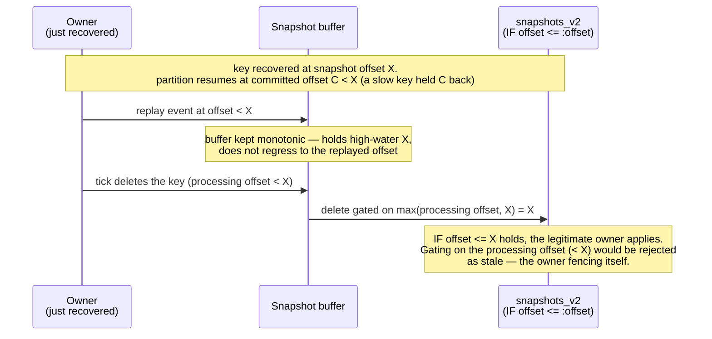

Design notes for the compare-and-set snapshot mode of `kafka-flow-persistence-cassandra`
(`CassandraSnapshots.withSchema(compareAndSet = true)`) — the mechanism and its subtleties. User-facing
enablement, costs and rollout guidance are in
[Persistence](persistence.md#protecting-against-stale-snapshot-writes). The Kafka backend solves the
same problem differently — see [Kafka single-writer design](kafka-single-writer-design.md).

The conditional write itself is the easy part. Most of this document is about not fencing the
*legitimate* owner: the delete path, the replay window and deleted-key recovery are where a
lightweight-transaction guard that looks trivial turns out not to be.

## Problem

[kafka-flow#732](https://github.com/evolution-gaming/kafka-flow/issues/732): during a rebalance a
previous owner that has not yet observed the revocation keeps flushing snapshots alongside the new
owner, and the last-write-wins snapshots table lets a stale write overwrite a newer one — the next
recovery then loads stale state and skips the events in between. The
[Kafka design doc](kafka-single-writer-design.md) covers the failure in full. The Cassandra-specific
point: Cassandra has a conditional write (a Paxos lightweight transaction) but no transaction to bind
the input-offset commit to, so the fence is **per write**, not a transaction.

## Mechanism: compare-and-set

The stored offset is a per-key [fencing token](https://martin.kleppmann.com/2016/02/08/how-to-do-distributed-locking.html):
every persist asserts the stored offset is not greater than the one being written, so the
newest-by-offset writer wins regardless of who it is. The write is a Paxos lightweight transaction,
linearizable per partition key, so concurrent writers to one key are ordered without relying on clock
synchronisation:

```sql
UPDATE snapshots_v2 SET ... , offset = :offset WHERE <key> IF offset <= :offset
```

The first write of a key finds no row, so the conditional `UPDATE` does not apply; it falls back to
`INSERT ... IF NOT EXISTS`. If that loses a race to a concurrent insert, the conditional `UPDATE` is
retried once, so the newest snapshot still wins a first-write race. A rejected write raises
`SnapshotWriteConflict`. A not-applied result reports the stored `offset` when Cassandra returns it
and treats its absence as "row absent" (a present-but-null `offset` is instead a guard-expired row —
see *TTL reconfiguration and the expired guard*).

The guard is per **key**, the right granularity: #732 corruption is per key and keys are independent,
so per-key monotonic durability is exactly what prevents it.

## Delete: offset-carrying tombstone

A delete cannot be a plain `DELETE`. Removing the row removes the `offset` guard with it, so a lagging
zombie's `INSERT ... IF NOT EXISTS` at a lower offset would then succeed — resurrecting a stale
snapshot. A later recovery would fold new events onto that resurrected base, silently losing the
delete: #732 reintroduced for that key.

So the compare-and-set delete (`deleteCompareAndSet`) writes an offset-carrying logical **tombstone**

```sql
UPDATE snapshots_v2 SET value = null, offset = :offset WHERE <key> IF offset <= :offset
```

keeping the row (and its `offset`). A stale lower-offset writer is then rejected, not resurrected; a
replayed delete is a no-op (equal offset) or a conflict (a newer write exists), never a resurrection;
a read surfaces the null `value` as a `Stored.Tombstone` (no live value). The tombstone is reaped by
the TTL, if configured. Keeping the row also routes the delete through Paxos, avoiding the well-known
hazard of mixing lightweight transactions and regular mutations on the same row.

### A never-persisted key

The tombstone above assumes the delete finds a row to gate. A key created and deleted within a single
flush window is never durably persisted, so its delete finds no row — and `Persistence.delete`
dispatches such a buffer-only delete `persist = false`, which for economy would normally skip the store
write. In a *fenced* store that skip reopens exactly the resurrection above: with no tombstone, and the
consumer offset committed past the delete, a revoked owner (zombie) still holding the key's buffered
pre-delete snapshot can flush it onto the absent row — gated only by this store's compare-and-set, not
the consumer generation — durably resurrecting the deleted key, permanently, since recovery then resumes
past the delete. So a fenced store writes the tombstone even for a never-persisted key:
`Snapshots.delete` overrides `persist = false` when fenced, and `deleteCompareAndSet`'s row-absent branch
INSERTs the offset-carrying tombstone `IF NOT EXISTS` (mirroring the persist first-write compound, with
the same lost-race retry) rather than no-opping. The economy — skip the write — is kept only for the
unfenced last-write-wins store, which has no offset gate to arm anyway. The window is narrow (a
create-and-delete within one flush interval, overlapping a zombie that still holds the pre-delete
snapshot), but the resurrection it admits is permanent, so the fence is unconditional in fenced mode.

Gating deletes has an API cost — the offset must reach the store through the delete path, a breaking
change for custom stores; see [Compatibility and rollout](#compatibility-and-rollout).

## The replay window

A delete and a re-persist are fenced on an offset that, just after recovery, can legitimately trail
the key's own stored snapshot. The partition resumes from the committed offset `C` (the minimum offset
still held across all of its keys); a single slow key can hold `C` well below a fast key's durable
snapshot offset `X` (the offset-lags-state invariant only guarantees `C <= X`). On recovery the
partition's processing offset starts at `C`, while the recovered snapshot's offset is `X`.



If, in this window, the owner issues a write for that key:

- a **time-driven tick** that deletes the key would gate the delete on the processing offset `C` —
  `IF offset <= C` against the stored `X > C` rejects it, **crashing the legitimate owner** with a
  `SnapshotWriteConflict` that reads as if another writer owned the key;
- a **periodic flush** during replay would re-derive the snapshot and try to persist it at the
  replayed offset (`< X`) — the same rejection.

Neither is a safety problem (the durable snapshot stays at `X`), but both are a liveness problem: the
owner fences *itself*. The cause is that a naive buffer `append` regresses the in-memory snapshot's
offset while replaying events below `X`.

The fix keeps the buffered snapshot **monotonic in offset**: `Snapshots.append` drops a lower-offset
append rather than regressing the buffer (sound because, under the determinism the design already
assumes, re-folding events `<= X` reproduces the same state — see below). The buffer therefore stays
at the key's high-water `X`, so

- a delete is fenced on `max(currentOffset, highWater)` — the legitimate owner presents `X` and
  applies, while a genuinely stale writer (which only ever *reached* its own lower offset, never `X`)
  still presents that lower offset and stays fenced;
- a re-derived snapshot is not re-persisted below `X` (the buffer stays `persisted`), so the flush is
  a no-op.

Of these two, only the **delete** is irreducible *for a live recovered snapshot*. `SnapshotFold` folds
only records past the recovered offset (`record.offset > snapshot.offset`), so a re-derived snapshot
below `X` is never even appended — the monotonic `append` is belt-and-suspenders for the persist case. A **tick-delete**
(`TickToState`) is timer-driven and bypasses that filter, so only the monotonic buffer lets a legitimate
tick-delete apply during replay.

The fence is live only for the compare-and-set wiring, which passes `Some(_.offset)`; the
last-write-wins Cassandra module and other stores wire unfenced (`None`) — their stores never reject a
write or return a tombstone floor, so the fenced buffer would only change their buffering semantics
and add a per-key floor read to events-recovery (`CassandraPersistence.snapshotsOf` keeps the fence
mode-scoped). It is surgical even when live: `max(currentOffset, highWater)` differs from
`currentOffset` only inside this replay window.

This fence and the tombstone above are independent and complementary: presenting the higher `highWater`
for a delete makes the tombstone it writes *more* protective against a lower-offset revive, never less.

### Recovering a deleted key

Both protections above are keyed on the high-water `X`, which a recovery establishes from the *recovered
snapshot's* offset. But a deleted key's row is a tombstone — its `value` is null, read back as absent — so
a read that surfaced only the value would establish no floor: the buffer would start empty and
`Snapshots.append` would climb from the replayed offsets (all `< X`), re-persisting below `X`. The
offset-`X` tombstone then rejects that write, fencing the *legitimate* owner; the flow tears down,
re-recovers the same tombstone (again no floor), and loops — a livelock. (`SnapshotFold`'s filter is keyed
on the same recovered offset, so it too has no floor for a tombstone; the monotonic buffer is what carries
the deleted-key case. A replay-window tick-**delete** here is dispatched `persist = false`; in a fenced
store that still writes the tombstone — see *A never-persisted key* above — but harmlessly, either creating
the fence or, when a tombstone floor was recovered, idempotently re-stamping it at the high-water `X`.)

So recovery must surface the tombstone's offset as the floor, not collapse it to "nothing there".
`SnapshotDatabase.read` returns `Stored.Tombstone(X)` for a tombstone — value-less but carrying the
offset — distinct from `None` for a reaped or never-written key (and from `Stored.Live(v, X)` for a
live snapshot); `Snapshots` holds `X` as the buffer high-water even with no buffered value, so a re-derived
snapshot below `X` is dropped exactly as for a live snapshot and the owner makes progress. The deleted-key
recovery is thus symmetric with the live one — same floor, only the value is absent — and the floor is
re-established on every recovery, so the livelock cannot form. (Because `read` returns one `Stored`, a
wrapper such as the metrics one has a single read to delegate — there is no separate value-only path that
could silently drop the tombstone's offset.)

The same hazard reaches the **events-recovery** mode (`restoreEvents`), where state is restored by folding
the journal rather than reading the snapshot. A delete clears the key's journal, so the fold yields `None`
and the high-water `X` survives only on the snapshot tombstone — the buffer would again start with no floor.
So events-recovery reads the snapshot store (`ReadState` runs `Snapshots.read`, seeding the buffer cell —
a tombstone's floor, or a live snapshot) before folding the journal. The read runs only for a fencing
buffer — an unfenced one never reads back a tombstone, so the per-key round-trip is skipped.

Events-recovery has a second, subtler exposure: **the journal revive**. The journal is *unfenced* —
appends are plain inserts, so nothing stops a stale owner's replayed appends from landing *after* a
delete cleared the journal (nor a journal TTL from reaping its tail below a live snapshot). Those
residue rows sit *below* the deletion tombstone's offset. A recovery that folds the whole journal
resurrects the deleted key *durably*, because the flow then persists forward from a fresh offset and
every later write legitimately passes the fence.

The guard folds the journal **onto the fenced store's view, skipping every journal row at or below the
store's offset** (`ReadState`, via `Snapshots.floor`): a tombstone's offset or a live snapshot's offset
is the floor, and residue below it is dropped — it is either already reflected in the recovered base or
stale pre-delete garbage. Crucially the filter is on the *event offset*, not on the fold's result. An
earlier attempt compared the fold's result to the store and discarded a fold that *trailed* it; that
holds at the first recovery but fails at the next: once legitimate post-delete events advance the
journal to or past the store's offset, the polluted fold no longer trails and the pre-delete residue
sails back through (offset is not provenance — a corrupt fold can trail, equal, *or* lead the store).
Filtering rows by offset keeps the residue below the floor forever, so the guard holds at *every*
recovery. This guard is only possible in the fenced mode: last-write-wins keeps no trustworthy floor to
filter against, so under LWW events-recovery remains exposed to the revive (a pre-existing property of
the unfenced journal, not something compare-and-set introduces — see `persistence.md`).

The delete's two-store order is load-bearing here: `Buffers.delete` writes the snapshot tombstone
*before* clearing the journal, so a crash between them leaves the durable tombstone plus journal residue
below it — which the floor filter drops — rather than a cleared journal with no tombstone, which would
silently lose the delete. The filter tolerates residue; it cannot recover a delete that never became
durable.

## Equal-offset writes and determinism

`IF offset <= :offset` admits an *equal* offset, so a stale writer holding exactly the stored offset is
not detected. This is deliberate. The legitimate owner can act at an offset it has already stored: a
tick can change state — or delete — without consuming a new record, and in the replay window above a
tick-delete is fenced on the high-water `X`, which equals the stored offset; a strict `<` would reject
these and fence the owner against itself. Admitting equal is safe not because the new value is identical
but because a same-offset write does not move the recovery point — unlike a lower-offset write it cannot
drop committed events (#732). The *records* folded into any two snapshots at the same offset are the
same, so a same-offset re-persist differs at most in time-driven tick state, never in event data; a
replayed delete is a no-op. Deterministic, replayable folds are therefore a precondition of the CAS
mode (as they already are of recovery generally) — the same property that lets the monotonic buffer
drop a lower-offset replay as a no-op.

## Consistency

The write-side fence only closes #732 if recovery reads can see what fenced writes committed, so
compare-and-set requires read **and** write consistency at a quorum (`R + W > N`). The conditional
write reaches consensus on a serial quorum but *materialises* at `ConsistencyOverrides.write`; with a
weaker write level a quorum recovery read can miss the newest committed snapshot even with no in-flight
Paxos — #732 reintroduced on the read side, which the write-side fence does not heal. And this is not
defaulted: `ConsistencyOverrides` is empty unless you set it, so the snapshot table inherits the
session's default level (often `LOCAL_ONE`) — you must configure both to a quorum.

A *serial* read is not required: `R + W > N` already makes a non-serial read see every committed
snapshot, and a still-in-flight write — one whose `persist` has not completed — is safe to miss
(recovery re-folds from the committed offset).

The Paxos consensus itself runs at the *serial* consistency level, which is separate from
`ConsistencyOverrides` (whose write level governs only the commit phase) and defaults to `SERIAL` — a
cross-datacenter quorum. For single-datacenter partition ownership (the common case) set the scassandra
client's `query.serial-consistency = LOCAL_SERIAL`, or every conditional write and delete pays a
cross-datacenter round-trip.

Pick the levels by ownership locality, not by the replication footprint (which may still span DCs for
DR): what matters is that a key's writers and its recovery read share one consistency domain. Single-DC
ownership pairs `LOCAL_QUORUM` reads/writes with `LOCAL_SERIAL`; ownership that can fail over between
DCs (or write a key from two DCs) needs the cross-DC `QUORUM` / `SERIAL` levels.

## Compatibility and rollout

**A breaking store API.** Gating deletes means a delete must carry an offset to the store, and recovery
must read a tombstone's offset back (the replay-window floor above). The store interface therefore
exchanges one `Stored` unit both ways — `read` distinguishes a live snapshot, an offset-carrying
tombstone and an absent row; `write` takes a `Stored.Live` or a `Stored.Tombstone` — replacing the
previous `get` / `persist` / `delete` triple, and the per-key buffer's delete gains the offset
(`delete(persist, offset)`). Source- and binary-breaking for custom `SnapshotDatabase` implementations,
hence a major-version bump. The alternative — fencing persists only — needs no API change but leaves
every deleted key open to resurrection (see Rejected alternatives).

**Rolling deploy.** Enabling on a running system needs no data migration (the condition reads the
`offset` column every version already writes). The one caveat: a lightweight transaction uses a
coordinator-generated write timestamp while a regular write uses a client-side one, so during a mixed
deploy an application clock running ahead of the coordinators can let an old (plain-write) instance's
snapshot shadow a newer conditional one. Negligible with NTP-synced clocks, and gone once every
instance writes conditionally.

**TTL.** The `offset` guard lives in the snapshot row, so it expires with the row's TTL: once a row's
TTL lapses a stale write can land a fresh `INSERT`. Harmless when the TTL far exceeds the
rebalance/zombie overlap window (the usual case — a zombie outliving the TTL is not realistic), but the
monotonicity guarantee only holds within the TTL. Without a TTL the offset-carrying tombstone is never
reaped — the table grows by one row per deleted key — so configure a TTL (comfortably above the overlap
window) for workloads that delete keys.

**TTL reconfiguration and the expired guard.** Cassandra TTLs are per **cell**, and only the delete
writes a subset of the columns (a persist rewrites all four), so enabling or shortening the `ttl`
between a key's persist and its delete lets the `offset` guard cell expire while older, longer-lived
cells — or the first write's `INSERT` row marker (immortal only when that write ran without a `ttl` and
the table has no `default_time_to_live`) — keep the row visible: a row that fences nothing
(`value = null`, `offset = null`). Under a uniform `ttl` from the first write this is unreachable — the
delete co-writes `offset` with `value`, so a visible row always carries a live guard; it is a
reconfiguration / pre-TTL-legacy state. Naively that row is poison: reading its offset
decodes the null as 0 (a silently absent floor), and no regular write can claim it (`IF offset <=
:offset` fails on the null guard while `INSERT ... IF NOT EXISTS` loses to the still-visible row — a
permanent conflict). So the mode handles the state explicitly: `read` reports a guard-expired row as
**absent** (a guard that is gone fences nothing — exactly a reaped row), a delete on it is an
idempotent no-op, and a persist claims it through the Paxos-safe repair write `IF offset = null`
(`Statements.prepareRepairPersist`), which reinstates the guard. The repair re-arms the guard but
(being an `UPDATE`) cannot remove an immortal marker, so such a row re-poisons after each `ttl` until
an owner deletes/reaps it — palliative, not curative. Concurrent claimants
serialize on Paxos — but note the repair condition is `offset = null`, a nullness check, not an offset comparison:
whoever wins reinstates the guard at *its* offset and any loser then conflicts on the reinstated guard,
so the repair is convergent but does not by itself order two claimants by offset (it is a first-write
claim of a guardless row, equivalent to `INSERT IF NOT EXISTS` after a full reap).
`SnapshotTtlEdgeSpec` reproduces the state against real Cassandra and pins the
handling. Prefer configuring the TTL from the first deployment anyway.

**Cassandra preconditions.** The fence inherits the store's linearizability: run Cassandra
≥ 3.0.24 / 3.11.10 / 4.0 — CASSANDRA-12126 broke linearizability for exactly the non-applying
conditional-write shape this mode issues — and leave the
`cassandra.unsafe.disable-serial-reads-linearizability` flag unset. Legacy Paxos also does not
guarantee linearizability across range movements (bootstrap, decommission, move); Cassandra 4.1's
Paxos v2 (`paxos_variant: v2`, with paxos repair scheduled) closes that window and is recommended.
And only this mode's statements may touch the table — mixing plain writes into LWT-managed rows voids
the guarantee (see the tombstone rationale above).

## Implementation

Entry point: `CassandraSnapshots.withSchema(compareAndSet = true)` (or
`CassandraPersistence.withSchema(snapshotCompareAndSet = true)`). In the current code:

- **Unified write / read** — `CassandraSnapshots.write` routes a `Stored`: a present value to
  `persistCompareAndSet`, an absent value (a delete) to `deleteCompareAndSet`, both issuing the offset-gated
  `UPDATE`/`INSERT`; `resolveConditional` classifies the result (`applied` / newer-stored-offset /
  row-absent), shared by both. `read` returns the stored unit — a `Stored.Live` or, for a tombstone, a
  `Stored.Tombstone` — or `None` for no row.
- **Monotonic buffer** — `Snapshots` holds one `Stored` cell (a live snapshot or an offset-carrying
  tombstone floor); `append` and `delete` both flow through one monotonic `put` that drops a lower-offset
  re-persist and lifts a lower-offset delete to the high-water. Recovery seeds the cell (and thus the floor)
  from `SnapshotDatabase.read`: `Stored.Tombstone(X)` is a tombstone at `X`, `None` is a reaped or
  never-written key.
- **Replay filter** — `SnapshotFold` folds only events past the recovered offset, dropping replayed
  ones at or below it; a timer-driven
  `TickToState` delete bypasses that filter, which is why the monotonic buffer is what carries the
  tick-delete case.
- **Events-recovery floor and revive guard** — `ReadState` runs `Snapshots.read` before folding the
  journal, seeding the buffer cell from the store (a tombstone's floor or a live snapshot), gated on
  `Snapshots.fenced` (skipped for an unfenced buffer). It then folds only the journal events whose
  offset exceeds the seeded floor (`Snapshots.floor`) onto the store's snapshot as the base — the
  offset filter that drops sub-floor residue at every recovery (the journal revive above).
- **Offset accessor** — the offset-carrying wiring passes `Some(_.offset)` (live fence); other stores
  pass `None` (unfenced, last-write-wins).

## Testing

- Store-level against real Cassandra (`SnapshotSpec`, persistence-cassandra-it-tests) — monotonic
  writes, stale-write rejection, the tombstone (no resurrection, replayed/stale delete, equal-offset),
  idempotent delete, TTL on both the insert and update paths, and concurrent first-writers racing on a
  fresh key (the highest offset wins, no corruption — exercising the first-write retry path).
- Through the real PartitionFlow / eager-recovery / flush-on-revoke machinery (`FlowSpec`,
  persistence-cassandra-it-tests) — the #732 reproduction asserts corruption under last-write-wins;
  the prevention asserts the stale flush is rejected; and a delete during replay below the recovered
  snapshot offset applies (fenced on the high-water), not rejected.
- In core — the monotonic buffer and the delete fence: `SnapshotsSpec` (the buffer directly, including
  the recovered `floor`) and `SnapshotsOfSpec` (the offset-of fencing wiring), with
  `SnapshotReplayFencingSpec` driving the replay-window cases flow-level against an offset-gated
  in-memory store, and `ReadStateFloorGateSpec` pinning the events-recovery seam — the fenced-only
  floor read and the journal-revive filter, including the second-recovery re-entry on both the
  tombstone and the live-snapshot arm.

## Assumptions

This design takes four things as given:

- **Per-key linearizable compare-and-set.** Each Cassandra lightweight transaction on a row is an atomic,
  linearizable operation (Paxos). The first-write `UPDATE`/`INSERT`/retry compound is *not* atomic.
- **Deterministic, replayable folds (a user contract).** Re-folding a recovered base over the same events
  reproduces the same state. This is what makes a lower-offset replay a no-op (so the buffer can stay
  monotonic) and what makes equal-offset writes idempotent. A non-deterministic fold breaks both.
- **Per-key independence.** #732 corruption is per key; keys are independent, so per-key monotonic
  durability is the whole guarantee.
- **Per-key serialization of a key's fold, tick and flush.** The buffer cell's individual operations are
  atomic, but `Snapshots`' flush (read the cell → write the database → mark it persisted) is not one
  atomic step; nor is a delete's decision to persist. kafka-flow never runs a key's processing, its
  timers, and its flush concurrently (one poll thread per partition drives them in sequence), so no
  concurrent `append` can slip between a flush's database write and its mark-persisted. A mid-flush timer
  on another thread would break this — a concurrency hazard, not a clock one, and out of scope here.

## Rejected alternatives

- **Persist-only scope (deletes unfenced)**: gate `persist` and keep `delete` a plain row removal — no
  store-API change, no major-version bump. Rejected as the end state: removing the row removes the
  `offset` guard with it, so a zombie's lower-offset `INSERT ... IF NOT EXISTS` resurrects any deleted
  key (see Delete above) — #732 stays open exactly where keys are deleted, and the plain delete mixes a
  regular mutation into a lightweight-transaction row. Viable only as an interim step for workloads
  that never delete keys.
- **Offset-as-write-timestamp (LWW register)**: write each snapshot `USING TIMESTAMP <offset>` and let
  Cassandra's last-write-wins reconciliation keep the highest-offset cell — a plain quorum write, much
  cheaper than a Paxos round, and a delete becomes a tombstone ordered by offset. Rejected as the
  default: equal-offset replacement breaks (at equal timestamps Cassandra breaks ties by value, not
  write order), a rolling deploy inverts catastrophically (old instances write wall-clock timestamps
  that dominate every offset-as-timestamp value), and it discards the real write timestamps.
- **Lease / ownership table**: a per-partition lease acquired with one LWT, then cheap writes. The
  lease alone does not stop a paused leaseholder's plain writes (last-write-wins still applies), so a
  per-write fencing token is still required — at which point the lease only adds liveness/expiry
  concerns on top of the per-write CAS.
- **Composite `(offset, generation)` token**: gate on the consumer generation as well as the offset,
  closing the equal-offset gap and giving per-partition (not just per-key) ownership. Generation
  *alone* — the Kafka mode's sole mechanism — is not enough here: there the group coordinator validates
  the generation server-side, while a Cassandra condition only compares self-reported numbers, so
  correctness would rest on every ownership change bumping the generation (static membership shares a
  generation across incarnations of an instance; a recreated or renamed group resets it) — whereas the
  offset is the #732 invariant itself and already in the row. Generation can therefore only complement
  the offset, never replace it. Rejected as a default because it couples the self-contained Cassandra
  module to the live consumer generation; reasonable as a future strict mode.
- **Recovery-side reconciliation** (store the offset, recover from the lowest): does not prevent the
  stale overwrite (last-write-wins still corrupts), so strictly weaker than fencing the write.

## Forward-looking

[KIP-939 (participation in 2PC)](https://cwiki.apache.org/confluence/display/KAFKA/KIP-939:+Support+Participation+in+2PC)
could extend a Kafka generation fence to this Cassandra store: a transactional producer in an
externally-coordinated two-phase commit could bind the Cassandra snapshot write to a generation-fenced
Kafka input-offset commit, giving Cassandra per-partition ownership without the per-key compare-and-set.
Not actionable now; see the Kafka design doc's forward-looking note.
