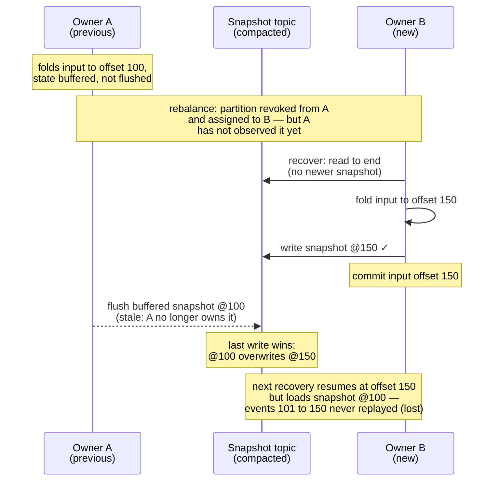
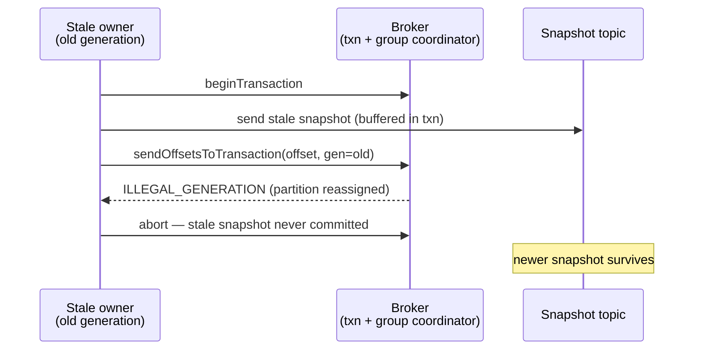

Design notes for the transactional snapshot mode of `kafka-flow-persistence-kafka`
(`KafkaPersistenceModuleOf.cachingTransactional`) — the mechanism and the measurements behind it.

## Problem

[kafka-flow#732](https://github.com/evolution-gaming/kafka-flow/issues/732): consumer-group
ownership of the input topic does not extend to the snapshot topic. During a rebalance a previous
owner that has not yet observed the revocation (network issue, GC pause, slow poll loop) keeps
writing snapshots alongside the new owner. The snapshot topic is compacted (last-write-wins), so a
stale snapshot can overwrite a newer one; the next recovery then loads stale state and loses the
events between the two snapshots, even though their input offsets were committed. Overlaps of tens
of seconds have been observed in production.

## Mechanism: generation fencing

Normally the input offsets are committed through the **Kafka consumer** (the ordinary consumer-group
offset commit). In this mode they are committed through the snapshot **producer** instead, with the
consumer-side commit disabled — the offset moves **into the producer's transaction** via
`sendOffsetsToTransaction(offsets, consumerGroupMetadata)`
([KIP-447](https://cwiki.apache.org/confluence/display/KAFKA/KIP-447%3A+Producer+scalability+for+exactly+once+semantics)):
the group coordinator validates the consumer **generation** and rejects a commit from a stale one
(`ILLEGAL_GENERATION`).
Since that commit and the snapshot writes share a transaction, the rejection aborts the writes too.
The generation — authoritative for partition ownership — gates both, so a stale owner can neither
advance offsets nor overwrite a newer snapshot.

This is corruption prevention, not exactly-once. Output produces go through the application's own
producer, and the transaction wraps only the snapshot write and the offset commit, so they stay outside
it — enrolling them would be full transactional output, an explicit non-goal (see Rejected alternatives).
Output is therefore at-least-once: a replayed batch re-emits it, so the consuming side must tolerate
duplicates. The committed offset is the minimum held offset, always behind durable state, so it can
never outrun the snapshots on disk even though offset and writes may land in different transactions.

Key points:

- **Every** transaction carries the partition's committable offset, so every write is gated. When the
  committed offset needs to advance but no snapshot writes are pending — a periodic commit tick, or a
  revoke — an *offset-only* transaction is forced so the offset still moves.
- The offset-to-commit is **seeded with the assigned offset**, so even the first flush (before the
  first commit tick) is gated. Committing the assigned offset is a no-op.
- Recovery is forced to `read_committed` so a fenced writer's aborted records are invisible.
- The partition is never `consumer.commit`-ed in this mode; offsets only commit through the producer.
- Both the write and the offset-only commit are **synchronous** — there is no background committer, so
  the call itself drives the transaction and blocks on its outcome. That blocking is what lets a fence
  (`CommitFailedException`) propagate into the flow and crash a stale owner, rather than being lost on a
  fire-and-forget commit thread.

Wiring needs the input topic and a reader of the driving consumer's group metadata
(`Consumer.groupMetadata`, captured on each rebalance on the poll thread). A fence surfaces as
`CommitFailedException` on the failing snapshot write (or offset-only commit).

### No epoch fencing

Generation fencing is the sole mechanism; there is deliberately no producer-epoch fencing. Each
producer gets a unique `transactional.id` (`"{prefix}-{partition}-{uuid8}"`), so old and new owners
never share one. A *stable* per-partition id would add cross-owner epoch fencing, which is both
redundant and harmful: the epoch is assigned in `initTransactions` arrival order, not assignment
order, so a slow stale owner that inits late wins the epoch and would false-positive-fence the true
owner. The cost of unique ids — transaction-coordinator state expiring via
`transactional.id.expiration.ms` — is accepted. A hard-crashed owner's in-flight transaction is, for
the same reason, not fenced on the spot (a stable id would abort it through the new owner's
`initTransactions`); the coordinator reclaims it only after `transaction.timeout.ms`, which bounds how
long a `read_committed` reader (recovery, or a downstream consumer) can stall behind its
last-stable-offset.

## Write path: group-committed transactions

A producer allows one transaction at a time, while kafka-flow flushes a partition's keys in
parallel — and after a restart most of the active key population flushes in one wave per
`persistEvery`. Writes are therefore **group committed**: a write is queued, and the first writer to
take the per-partition transaction lock drains the queued writes at that moment — up to the cap below —
into a single transaction (offset commits ride along without consuming the cap) and delivers the outcome
to each waiter. No batching delay — a lone write commits immediately; a batch is whatever accumulated
during the previous transaction's flight.

`maxWritesPerTransaction` (default 256) caps the batch. Transactions are serial — the next cannot
begin until the current commits — so a partition's sustained write rate ≈ cap / transaction time.
Raising the cap past the default gains little (uncapped measured ~7% faster, below): transaction time
grows with the batch. The cap's job is to bound transaction duration (commit within
`transaction.timeout.ms`, default 1 min) and bytes (≈ cap × snapshot size).

A snapshot write does not complete until its transaction commits, and the flush awaits each write, so
the source is back-pressured: the in-flight queue holds at most the keys flushing in one wave, bounding
memory rather than letting it grow without limit. Sustaining writes above that rate surfaces as rising
flush latency and lag.

## Implementation

Entry point: `KafkaPersistenceModuleOf.cachingTransactional`. In the current code:

- **Group-committed transactional writes** — `KafkaSnapshotWriteDatabase.transactional` (the
  `GroupCommit` machinery); the per-partition transactional producer is built in `KafkaPersistenceModule`.
- **Offset-only commit** (the forced offset advance when no writes are pending) — `ScheduleCommit`.
- **Generation capture** on each rebalance — the `Consumer` wrapper, holding `groupMetadata` in a `Ref`
  read off the poll thread.

## Measurements

From `TransactionalWriteThroughputSpec`: single-node testcontainers broker on localhost, replication
factor 1, no network latency — a *floor*; expect a few ms per transaction against real brokers. Each
number is the min of 3 interleaved runs on a fresh state topic. Read them as orders of magnitude.

**Experiment A** — 500 keys, small snapshots, one partition:

| Mode | Arrival | Result |
|---|---|---|
| Shared batched producer (default, no transactions) | sequential | 197 ms |
| Group-committed transactions | sequential | 879 ms (500 txns, ~1.8 ms/txn) |
| Group-committed transactions | concurrent burst | 13 ms (a few batches) |

The lower two rows are the same group commit — only arrival differs. Sequentially every write is a
batch of one; concurrently (the real flush pattern) writes collapse into a few large batches, below
even the non-transactional producer.

**Experiment B** — 2000 keys, 10 KiB snapshots, all flushed concurrently (the post-restart wave).
The cap bounds writes per transaction, so for `N` keys it is ≈ the transaction count (`N / cap`):

| Configuration | ≈ transactions | Result |
|---|---|---|
| Shared batched producer (baseline) | — | 282 ms |
| `maxWritesPerTransaction = 1` | 2000 | 4 002 ms |
| `maxWritesPerTransaction = 16` | 125 | 513 ms |
| `maxWritesPerTransaction = 256` (default) | ≈ 8 | 300 ms |
| `maxWritesPerTransaction = 2000` (uncapped) | 1 | 279 ms |

Cost tracks the transaction count until Kafka's network batching floors it (~280–300 ms). At the
default cap the transactional burst is within ~6% of the baseline; without the group commit
(cap = 1) it is an order of magnitude slower, with multi-second poll-path stalls at realistic key
counts.

Reproduce: `KAFKA_FLOW_PERF=1 sbt "persistence-kafka-it-tests/testOnly *TransactionalWriteThroughputSpec"`
(the suite is excluded from the default run).

## Testing

Integration tests (`TransactionalKafkaPersistenceSpec`, in persistence-kafka-it-tests) run through the
real eager-recovery / flush-on-revoke machinery. The reproduction shows corruption with the plain shared producer (no offset binding); the
prevention drives a stale owner with an *older consumer generation* and asserts the newer snapshot
survives — isolating the offset binding as the cause, not incidental fencing. Other pins: first-flush
gating (the seed), a fenced writer fails its next flush, an open transaction neither blocks nor leaks
into recovery, concurrent-write safety. The group commit is exercised in isolation by `GroupCommitSpec`, a unit test with a
recording in-memory producer (no broker).

## Rejected alternatives

- **Transactional snapshot read + write**: write only if the stored snapshot is still the expected
  previous value, fencing a stale writer. No conditional produce on a Kafka topic, so the
  assert-and-write cannot be atomic.
- **Transaction per write**: correct but O(keys) round-trips on the poll path (cap = 1 above).
- **Unbounded batches**: ~7% faster, but transaction duration then scales unbounded against the
  coordinator timeout.
- **Producer-epoch fencing (stable `transactional.id`)**: epoch order can diverge from ownership
  order, so it does not fully close #732 and can false-positive-fence the true owner (above).
- **Transactional output produces (full exactly-once)**: out of scope; output stays at-least-once.
- **Static partition assignment** (`assign()` instead of `subscribe()`): no consumer group, no
  rebalance, so no overlap window and no fence needed — the workaround [#732](https://github.com/evolution-gaming/kafka-flow/issues/732)
  itself names. Rejected because it gives up automatic failover and elastic reassignment; letting
  users keep dynamic assignment *safely* is the point of this design. (Static *membership* (KIP-345)
  is not an alternative here: it suppresses rebalances only for graceful restarts within
  `session.timeout.ms`, and does not fence a stuck owner whose session expired.)

## Forward-looking

[KIP-939 (participation in 2PC)](https://cwiki.apache.org/confluence/display/KAFKA/KIP-939:+Support+Participation+in+2PC)
is the route to extend this fence to non-Kafka snapshot stores: a transactional producer in an
externally-coordinated two-phase commit could bind a snapshot write in another store (e.g. Cassandra or
an RDBMS) to the same generation-fenced Kafka offset commit, giving that store the per-partition
ownership guarantee this mode has. Not actionable now.
