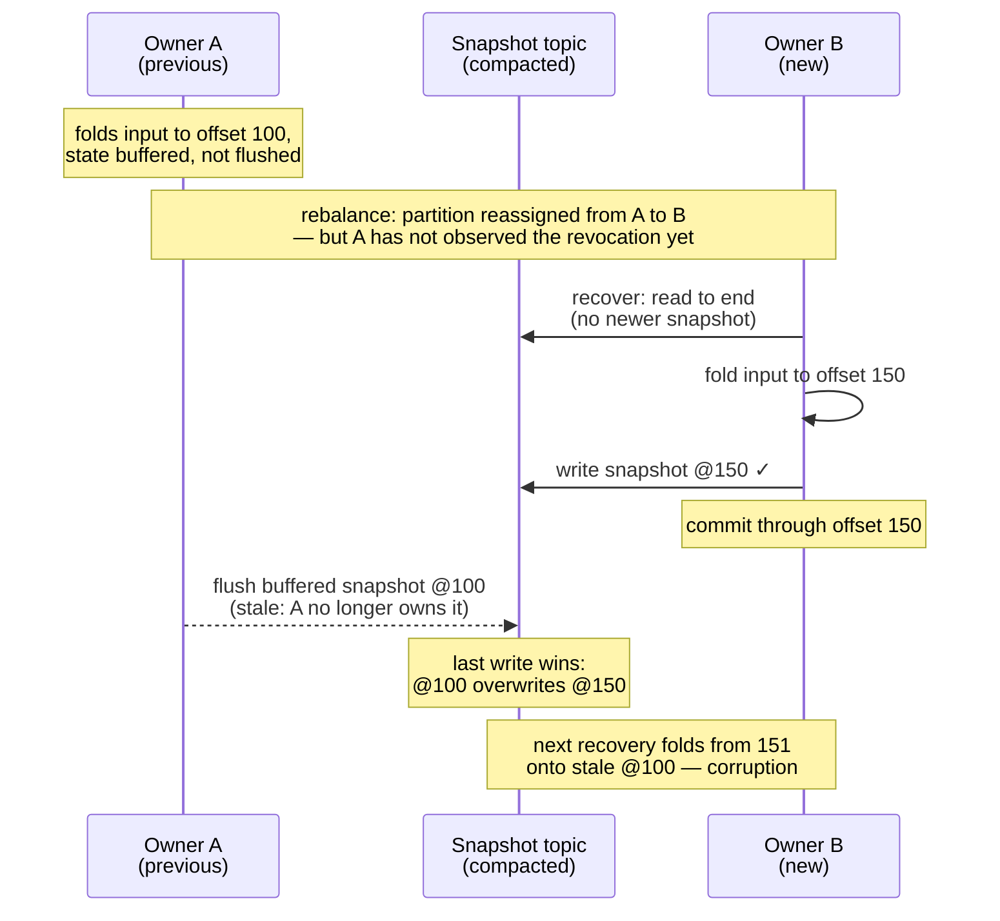
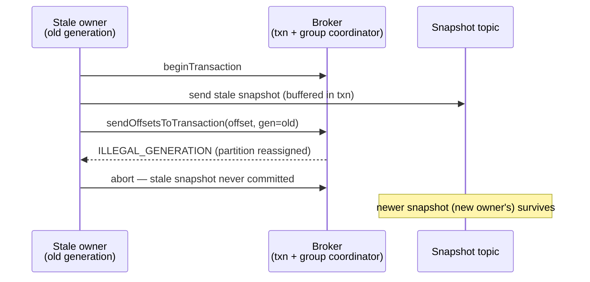

Design notes for the transactional snapshot mode of `kafka-flow-persistence-kafka`
(`KafkaPersistenceModuleOf.cachingTransactional`) — the mechanism and the measurements behind it.

## Problem

[kafka-flow#732](https://github.com/evolution-gaming/kafka-flow/issues/732): consumer-group
ownership of the input topic does not extend to the snapshot topic. During a rebalance a previous
owner that has not yet observed the revocation (network issue, GC pause, slow poll loop) keeps
writing snapshots alongside the new owner — overlaps of tens of seconds have been observed in
production. The snapshot topic is compacted (last-write-wins), so a stale snapshot can overwrite a
newer one; the next recovery then loads stale state but resumes from the committed offset, so the
events between the two snapshots are never re-folded — corrupting the state.

## Mechanism: generation fencing

In the default (non-transactional) mode the input offsets are committed through the **Kafka consumer**
(the ordinary consumer-group offset commit). In this mode they are committed through the snapshot
**producer** instead, with the consumer-side commit disabled — the offset moves **into the producer's
transaction** via
`sendOffsetsToTransaction(offsets, consumerGroupMetadata)`
([KIP-447](https://cwiki.apache.org/confluence/display/KAFKA/KIP-447%3A+Producer+scalability+for+exactly+once+semantics)):
the group coordinator validates the consumer **generation** and rejects a commit from a stale one
(`ILLEGAL_GENERATION`, surfaced to the client as `CommitFailedException`).
Since that commit and the snapshot writes share a transaction, the rejection aborts the writes too.
The generation — authoritative for partition ownership — gates both, so a stale owner can neither
advance offsets nor overwrite a newer snapshot.

Seen as a whole, the mechanism combines two ideas — a distributed lock, and a transactional snapshot
write + offset commit. Kafka's consumer group is the lock, and it already provides both an ownership
*lease* and a [fencing token](https://martin.kleppmann.com/2016/02/08/how-to-do-distributed-locking.html):
the partition assignment is the lease, and the **generation** (bumped on each rebalance) is the token.
What is missing by default is only the link: the snapshot write is not bound to the fenced offset
commit. Binding them in one transaction is the link.

This is corruption prevention, not exactly-once. Output produces go through the application's own
producer, and the transaction wraps only the snapshot write and the offset commit, so they stay outside
it — enrolling them would be full transactional output, an explicit non-goal (see Rejected alternatives).
Output is therefore at-least-once: a replayed batch re-emits it, so the consuming side must tolerate
duplicates. The **committable offset** — the minimum offset still held across the partition's keys — is
never ahead of the persisted snapshots: an offset becomes committable only after its snapshot is
persisted, so recovery never skips events.

Key points:

- **Every** transaction commits the partition's current committable offset, so every write is gated. The
  offset itself advances only on the periodic offset-commit interval (`commitOffsetsInterval`, separate
  from the snapshot-flush interval `persistEvery`) or on revoke; a snapshot write never advances it, it
  just re-commits the current value to stay gated. That advance is committed in a transaction — batching
  in any snapshot writes queued at that moment, or committing the offset alone (an *offset-only*
  transaction) when there are none.
- The offset-to-commit is **seeded with the assigned offset**, so even the first snapshot flush (before
  the first commit tick) carries an offset and is gated.
- Recovery is forced to `read_committed` so a fenced writer's aborted records are invisible.
- The ordinary consumer-group offset commit is **replaced**, not run alongside. In the default mode the
  committable offset is staged and the **consumer** commits it; in this mode that same offset-scheduling
  step is rerouted to the **producer**, so the offset is committed only inside the transaction (above).
  The consumer-commit path still runs each poll cycle but now finds nothing staged — a no-op — so the
  partition is never committed through the consumer.
- Both the write and the offset-only commit are **synchronous** — there is no background committer, so
  the call itself drives the transaction and blocks on its outcome. That blocking is what lets a fence
  (`CommitFailedException`) propagate into the flow and crash a stale owner, rather than being lost on a
  fire-and-forget commit thread.

The mechanism needs the input topic-partition and a reader of the driving consumer's group metadata
(`Consumer.groupMetadata`, captured on each partition assignment and refreshed after every poll, on the
poll thread). Both are supplied by the flow from the partition assignment — not configured by hand — so
they always match the consumer that drives the flow. A fence surfaces as `CommitFailedException` on the
failing snapshot write (or offset-only commit).

### No epoch fencing

Generation fencing is the sole mechanism; there is deliberately no producer-epoch fencing. Each
producer gets a unique `transactional.id` (`"{prefix}-{partition}-{uuid8}"`), so old and new owners
never share one. A *stable* per-partition id would add cross-owner epoch fencing, which is both
redundant and harmful: with a shared id each `initTransactions` bumps the epoch and fences the
previous holder, so whichever owner inits *latest* wins — a race unrelated to who actually owns the
partition. A slow stale owner that inits late therefore wins the epoch, its stale write lands (the
fence fails), and the true owner is fenced instead.

The cost of unique ids — transaction-coordinator state expiring via `transactional.id.expiration.ms` —
is accepted. A hard-crashed owner's in-flight transaction is, for the same reason, not fenced on the
spot (a stable id would abort it through the new owner's `initTransactions`); the coordinator reclaims
it only after `transaction.timeout.ms`, which bounds how long a `read_committed` reader (recovery, or a
downstream consumer) can stall behind its last-stable-offset.

## Write path: group-committed transactions

A producer allows one transaction at a time, while kafka-flow flushes a partition's keys in
parallel — and after a fresh assignment most of the active key population flushes in one wave per
`persistEvery`. Writes are therefore **group committed**: a write is queued, and the first writer to
take the per-partition transaction lock drains the queued writes at that moment — up to the cap below —
into a single transaction (offset commits ride along without consuming the cap) and delivers the outcome
to each waiter. No batching delay — a lone write commits immediately; a batch is whatever accumulated
during the previous transaction's flight.

`maxWritesPerTransaction` (default 256) caps the batch. Transactions are serial — the next cannot
begin until the current commits — so a partition's sustained write rate ≈ cap / transaction time.
Raising the cap past the default gains little (uncapped measured ~7% faster, below): transaction time
grows with the batch. The cap's job is to bound transaction duration (commit within
`transaction.timeout.ms`, default 1 min) and bytes (≈ cap × snapshot size).

A snapshot write does not complete until its transaction commits, and the flush awaits each write, so
the source is back-pressured: outstanding writes are bounded by the flush concurrency (one per live key
in the wave), not by internal buffering.

## Implementation

Entry point: `KafkaPersistenceModuleOf.cachingTransactional`. In the current code:

- **Group-committed transactional writes** — `KafkaSnapshotWriteDatabase.transactional` (the
  `GroupCommit` machinery); the per-partition transactional producer is built in `KafkaPersistenceModule`.
- **Offset commit** (on the periodic tick / on revoke; an offset-only transaction when no snapshot
  writes are pending) — `ScheduleCommit`.
- **Consumer-commit reroute** — at wiring the module's `scheduleCommit` (the transactional `ScheduleCommit`)
  overrides the default consumer-backed one (`kafkaPersistenceModule.scheduleCommit.getOrElse(...)` in the
  persistence-kafka `package` object). That bypasses the default path, where offsets are normally staged
  through `PendingCommits` and committed by `TopicFlow.commitPending` via `consumer.commit`; with nothing
  staged, it commits nothing (a no-op).
- **Generation capture** — the `Consumer` wrapper, holding `groupMetadata` in a `Ref` read off the poll
  thread. Captured on each partition assignment *before* the wrapped listener runs (the recovery and
  flushes it triggers are gated by the generation that assigned them), and refreshed after every poll:
  listeners see only partitions that changed hands, so a rebalance that assigns a member nothing new —
  possible with a cooperative assignor — would otherwise leave the captured generation behind and
  spuriously fence the next flush of a retained partition. Publishing after the poll is safe: revoked
  partitions were flushed inside it under the pre-rebalance generation, so every flow still alive is
  owned in the refreshed one.

## Measurements

From `TransactionalWriteThroughputSpec`: single-node testcontainers broker on localhost, replication
factor 1, no network latency — a *floor*; expect a few ms per transaction against real brokers. Each
number is the min of 3 runs on a fresh state topic. Read them as orders of magnitude.

**Experiment A** — 500 keys, small snapshots, one partition, cap held at the default (256); the only
thing that varies is whether the writes are issued one at a time (sequentially) or all at once
(concurrently):

| Mode | Issued | Result |
|---|---|---|
| Shared batched producer (default, no transactions) | one at a time | 197 ms |
| Group-committed transactions | one at a time | 879 ms (500 txns, ~1.8 ms/txn) |
| Group-committed transactions | all at once | 13 ms (a few batches) |

This isolates one variable: group commit only pays off when writes are issued together. Issued one at a
time, nothing batches, so transactions run one per write — several times slower than the plain producer;
issued all at once, they collapse into a few transactions and that cost is gone. The plain producer is
measured one-at-a-time only as a reference point — not a fair head-to-head, since nothing makes it batch
here. The fair comparison, both issued concurrently against realistic payloads, is Experiment B.

**Experiment B** — 2000 keys, 10 KiB snapshots, flushed **concurrently** (the *post-assignment wave*: a
new owner recovers all its keys, so they fall due together, and the timer tick fans the per-key flushes
out concurrently — `parTraverse` across keys in `PartitionFlow`, which the test mirrors). The cap bounds
writes per transaction, so the transaction count is ≈ `N / cap`:

| Configuration | ≈ transactions | Result |
|---|---|---|
| Shared batched producer (baseline) | — | 282 ms |
| `maxWritesPerTransaction = 1` | 2000 | 4 002 ms |
| `maxWritesPerTransaction = 16` | 125 | 513 ms |
| `maxWritesPerTransaction = 256` (default) | ≈ 8 | 300 ms |
| `maxWritesPerTransaction = 2000` (uncapped) | 1 | 279 ms |

Cost tracks the transaction count until Kafka's network batching floors it (~280–300 ms). At the
default cap the burst is within ~6% of the plain baseline; at cap = 1 (a transaction per write) it is
an order of magnitude slower — multi-second poll-path stalls at realistic key counts.

Reproduce: `KAFKA_FLOW_PERF=1 sbt "persistence-kafka-it-tests/testOnly *TransactionalWriteThroughputSpec"`
(the suite is excluded from the default run).

## Testing

Integration tests (`TransactionalKafkaPersistenceSpec`, in persistence-kafka-it-tests) run through the
real eager-recovery (every key recovered on assignment) and flush-on-revoke machinery. The reproduction
shows corruption with the plain shared producer (no offset binding); the prevention drives a stale owner
with an *older consumer generation* and asserts the newer snapshot survives — isolating the offset
binding as the cause, not incidental fencing. Other cases covered: first-flush gating (the seed), a
fenced writer fails its next flush, an open transaction neither blocks nor leaks into recovery,
concurrent-write safety. The group commit is exercised in isolation by `GroupCommitSpec`, a unit test
with a recording in-memory producer (no broker).

## Rejected alternatives

- **Transactional snapshot read + snapshot write**: fence a stale writer with a compare-and-set on the
  stored offset. Kafka has no conditional produce primitive, so it cannot be atomic.
- **Producer-epoch fencing (stable `transactional.id`)**: epoch order can diverge from ownership
  order, so it does not fully close [#732](https://github.com/evolution-gaming/kafka-flow/issues/732)
  and can false-positive-fence the true owner (above).
- **Static partition assignment** (`assign()` instead of `subscribe()`): no consumer group, so no
  rebalance, no overlap window, no fence needed — but it gives up automatic failover and elastic
  reassignment, and safe *dynamic* assignment is the point of this design. (Static *membership*
  ([KIP-345](https://cwiki.apache.org/confluence/display/KAFKA/KIP-345%3A+Introduce+static+membership+protocol+to+reduce+consumer+rebalances))
  is not a substitute: it suppresses rebalances only for graceful restarts within `session.timeout.ms`,
  and does not fence a stuck owner whose session expired.)
- **Live `groupMetadata` reads (no capture)**: would never lag, but flush-on-revoke runs inside the
  rebalance callback, where the serialized consumer cannot be called (skafka exposes `RebalanceConsumer`
  there for exactly this reason); the client reports an unknown generation mid-rejoin and after falling
  out of the group, surfacing as wiring errors instead of a clean broker fence; and for a fencing token
  lagging is safe (the member fences itself and replays) while leading could let a stale write land —
  capture plus refresh keeps the safe side of that asymmetry by construction, not by scheduling luck.
- **Transaction per write**: correct but O(keys) round-trips on the poll path (cap = 1 above).
- **Unbounded batches**: ~7% faster, but transaction duration scales unbounded against the coordinator
  timeout.
- **Transactional output produces (full exactly-once)**: out of scope; output stays at-least-once.

## Forward-looking

This design is analyzed under the **classic** consumer rebalance protocol. Under
[KIP-848](https://cwiki.apache.org/confluence/display/KAFKA/KIP-848%3A+The+Next+Generation+of+the+Consumer+Rebalance+Protocol)
— GA since Kafka 4.0, supported by the kafka-clients on the classpath behind `group.protocol=consumer`
(`classic` is the default) — the reported "generation" becomes a *member epoch* that can advance on the
background heartbeat thread rather than only inside `poll`, validated as `STALE_MEMBER_EPOCH`. The
fail-safe direction appears preserved (a lagging token self-fences), but the capture/refresh timing
arguments here need re-auditing before the mode is used with it.

[KIP-939 (participation in 2PC)](https://cwiki.apache.org/confluence/display/KAFKA/KIP-939:+Support+Participation+in+2PC)
is the route to extend this fence to non-Kafka snapshot stores: a transactional producer in an
externally-coordinated two-phase commit could bind a snapshot write in another store (e.g. Cassandra or
an RDBMS) to the same generation-fenced Kafka offset commit, giving that store the per-partition
ownership guarantee this mode has. Not actionable now.
