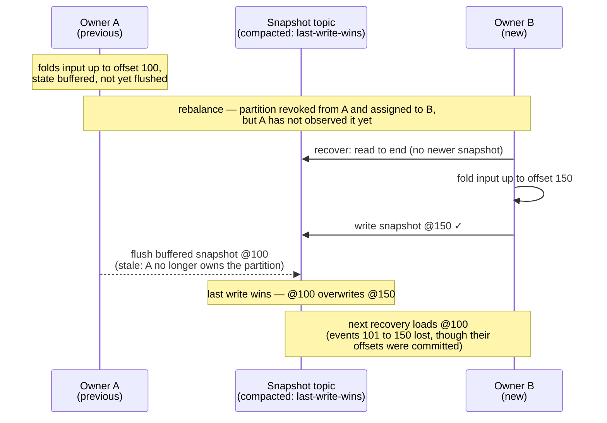
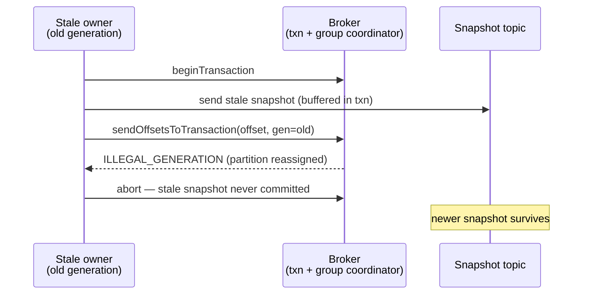
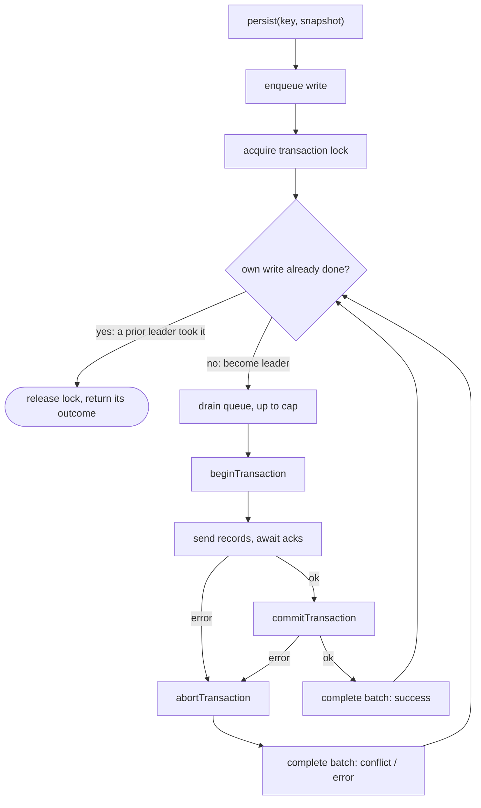

Design document for the transactional snapshot mode of `kafka-flow-persistence-kafka`
(`KafkaPersistenceModuleOf.cachingTransactional`) — the **Kafka** single-writer protection only.
The user-facing guarantees, costs and rollout guidance for both backends (including the lighter
Cassandra compare-and-set approach) live in
[Persistence](persistence.md#single-writer-guarantees); this page records the problem, the
decisions, why they were made, and the measurements behind them.

## Problem

[kafka-flow#732](https://github.com/evolution-gaming/kafka-flow/issues/732), recapped here from the
fuller account in [Persistence](persistence.md#single-writer-guarantees): consumer-group ownership
of the input topic does not extend to the snapshot topic. During a rebalance a previous partition
owner that has not yet observed the revocation (network issue, GC pause, slow poll loop) keeps
writing snapshots in parallel with the new owner. A compacted topic is last-write-wins, so the stale
snapshot overwrites the newer one and the next recovery silently starts from stale state: events
between the two snapshots are lost even though the input offsets were committed correctly. Overlaps
of tens of seconds have been observed in production.

Both protections in this family close this window by making the stale `@100` write **fail** instead
of overwriting `@150`. The Kafka mechanism is below; the Cassandra one is in
[Persistence](persistence.md#single-writer-guarantees).

## Goals and non-goals

Goals:

- A stale writer must not be able to overwrite a newer snapshot — at any point once a newer owner
  exists (i.e. the consumer group has rebalanced the partition away).
- Opt-in: the default (shared producer, no transactions) behavior stays byte-for-byte unchanged.
- The cost must be acceptable for bursty flush patterns (the synchronized post-restart flush waves
  described under "Write path").

Non-goals:

- Exactly-once *output*. The flow's own output-topic produces are not part of the snapshot
  transaction, so after a fenced/replayed batch the new owner re-emits them: output is at-least-once
  (duplicates possible), which the consuming side must tolerate. Only the snapshot store and the
  input-offset commit are made consistent.
- Non-identity partition mappers. Fencing is per input partition; a state partition shared by
  writers with different `transactional.id`s would make read-to-end recovery under `read_committed`
  ill-defined. The mode forces the identity mapping.

## Design

### Mechanism: transactional write and offset commit (generation fencing)

This is issue #732's "solution 1". The input-offset commit is moved out of the consumer and **into the
snapshot producer's transaction** via `sendOffsetsToTransaction(offsets, consumerGroupMetadata)`
(KIP-447): the group coordinator validates the consumer **generation** and rejects a commit from a
stale generation (`ILLEGAL_GENERATION`). Because the offset commit and the snapshot writes are in the
*same* transaction, that rejection aborts the snapshot writes too. The consumer generation —
authoritative for partition ownership — gates both, so a stale owner can neither advance offsets nor
overwrite a newer snapshot. This is the Kafka Streams EOS offset path, minus the transactional
*output* produces (we accept at-least-once output).

Each assigned partition gets a transactional producer with a unique-per-producer `transactional.id`
(the id is just a label — generation fencing, not the id, is the guard; see below), which calls
`initTransactions` and then group-commits its writes. With the offset seeded (below), **every** snapshot
write — including the first — is generation-gated, so this is the **sole, complete** guard for #732.
Two supporting pieces are **orthogonal** to the fencing: the **group commit** (throughput only — see
[Write path](#write-path-group-committed-transactions)) and **`read_committed` recovery** (hides the
aborted records of a fenced writer).

| Decision | Rationale |
|---|---|
| Commit offsets through the producer, not the consumer | The generation check on `sendOffsetsToTransaction` is what ties the fence to ownership; a consumer-side commit is not part of the transaction and cannot gate the snapshot writes. In transactional mode the partition is therefore never `consumer.commit`-ed. |
| Piggyback: every transaction carries the partition's committable offset | The offset is the min held-offset (only persisted state, so always behind the durable snapshot); attaching it to every transaction makes every snapshot write generation-gated. Chosen over a commit-driven (Streams-style) model to reuse the group commit and leave the per-key flush untouched. A `ScheduleCommit` also forces an offset-only transaction so progress — and the final on-revoke offset — commits even with no writes pending. |
| Seed the offset-to-commit with the assigned offset | The first flush runs before the first commit tick, so without help it carries no offset and is ungated (the "None window"). Seeding `offsetToCommit = assignedAt` gates even the first write, so generation fencing has no hole. Committing `assignedAt` is a no-op (already committed, never ahead of the snapshot), and the consumer has joined by assignment time so its generation is available. |
| Recovery forced to `read_committed` | A fenced writer's transaction is aborted, but its records sit in the log until compaction; `read_uncommitted` would resurrect them as valid snapshots. (`initTransactions` also waits out any open transaction of the previous incarnation, so the read-to-end target is exact.) |

Wiring requires the input topic and a reader of the driving consumer's group metadata
(`Consumer.groupMetadata`, captured on each rebalance on the poll thread). A fenced offset commit
surfaces as `KafkaSnapshotWriteConflict` (see "How a rejection surfaces").

### No epoch fencing; the `transactional.id` is a throwaway label

Generation fencing is the sole mechanism — there is deliberately **no producer-epoch fencing**. Each
producer gets a unique `transactional.id` (`"{prefix}-{partition}-{uuid}"`), so old and new owners of
a partition never share one and cannot fence each other; `initTransactions` is still called (it is
required to open transactions) but its epoch fences nothing real.

A *stable* per-partition id would add cross-owner epoch fencing, but that is redundant once generation
fencing is complete and actively harmful: the epoch is assigned in `initTransactions` arrival order,
not assignment order, so a slow stale owner that inits late wins the epoch and would
**false-positive-fence the true owner** (and could slip a stale first-flush write through). Generation
fencing tracks ownership directly and has neither flaw. The cost of unique ids — transaction-coordinator
state that expires via `transactional.id.expiration.ms` — is accepted at normal rebalance rates;
`transactionalIdPrefix` is just a label, with no contract.

### Write path: group-committed transactions

The Kafka producer allows one transaction at a time, while kafka-flow flushes a partition's keys in
parallel, and keys recovered together flush in synchronized waves — after a restart, every key that
changed since the last flush (in a busy partition: most of the active population) arrives as one
burst every `persistEvery`. One transaction per write
would serialize that burst on the consumer poll path (~4 s for 2000 keys, measured below). Writes
are therefore **group committed**: a write is queued, and the first writer to take the transaction
lock drains everything queued at that moment into a single transaction, delivering the outcome to
each waiter. There is no batching delay — a lone write commits immediately; a batch is whatever
accumulated during the previous transaction's flight. (The name is borrowed from database
write-ahead-log group commit; Kafka itself only provides the one-transaction-at-a-time producer.)

The queue and the transaction lock are **per partition**, like the producer — one of each, created
together with the partition's transactional producer and shared by all of that partition's keys. A
single transaction therefore commits snapshots for many different keys at once; there is no per-key
queue or transaction.

The leader runs one transaction for the whole batch and delivers its outcome to every drained write
before looping back to check its own; a write a prior leader already took returns immediately. Only
the send/await-acks step is cancelable — everything else is masked, for the reasons in the table.

| Decision | Rationale |
|---|---|
| Group commit, not time-window batching | Batching is purely opportunistic: sporadic writes pay zero added latency, bursts collapse to O(burst / cap) transactions. A batch shares its transaction's outcome — one failure fails them all (bounded by the cap). |
| Drain and completion run masked, only the ack await is cancelable | A canceled leader must never remove writes from the queue without delivering their outcome (waiters would hang or get a nonsense error), and must never leave an open transaction holding the lock's next user hostage (`onCancel: abort`). |
| `maxWritesPerTransaction` cap (default 256, configurable) | A *duration* bound, not a throughput knob — capping only lowers throughput (uncapped is ~12% faster, measured below), so it is never raised for speed. It keeps a transaction from outliving `transaction.timeout.ms` (default 1 minute), which the coordinator would abort (demonstrated below). Transaction bytes ≈ cap × snapshot size and this layer cannot see record sizes, so the bound is a count — lower it for large snapshots. |
| Fencing classified by walking the exception cause chain | A fenced producer moves to a fatal state; follow-up calls throw a generic `KafkaException` only *wrapping* the fencing exception. |
| Leader-based lock instead of a background committer fiber | A worker fiber would simplify the write path but adds a Resource lifecycle and a liveness dependency (a dead worker hangs all writes); the leader protocol keeps failure handling local to the writes. |

### Back-pressure

`persist` does not complete until its transaction commits, and kafka-flow's flush awaits each
`persist`, so the source is **back-pressured**: the `pending` queue holds at most the keys flushing
concurrently in one wave, never an open-ended backlog. If a partition produces writes faster than
`cap / transaction-time` can drain, the symptom is rising flush latency and consumer lag — not
unbounded memory — and the remedy is more partitions, not a longer transaction (which would only
trade lag for the coordinator's timeout abort).

### How a rejection surfaces

Verified by flow-level tests reproducing issue #732 end-to-end (`TransactionalKafkaPersistenceSpec`):

- During a **periodic flush**, the conflict fails the flow of the stale instance — safe, it no
  longer owns the partition (swallowed if `persistPeriodically(ignorePersistErrors = true)`).
- During **flush-on-revoke**, the conflict is logged and swallowed by the key release — appropriate
  for a partition that is being given away.
- In both cases nothing is written and no offsets are committed for the rejected write; the new
  owner replays the events.

One caveat found by deliberately breaking the timeout (see below): a transaction aborted by the
coordinator for outliving `transaction.timeout.ms` surfaces as `InvalidTxnStateException` on some
broker/client version-and-timing combinations — not classified as a conflict — but as
`InvalidProducerEpochException` on others, which **is** indistinguishable from real fencing. The
cap keeps transactions orders of magnitude below the timeout precisely so this ambiguity stays
theoretical.

## Measurements

From `TransactionalWriteThroughputSpec`: single-node testcontainers broker on localhost,
replication factor 1, no network latency — a *floor*; expect a few milliseconds per transaction
against real brokers. Each producer does an untimed warm-up write before measurement, and the
numbers below are from a single consistent run (they vary run to run — read them as orders of
magnitude, not exact figures). Two separate experiments:

### Experiment A — modes at a small fixed workload

500 keys, small string snapshots, one partition. Isolates per-transaction latency and what the
group commit buys on a concurrent burst.

| Mode | Arrival | Batches | Result |
|---|---|---|---|
| Shared batched producer (default mode, no transactions) | sequential | — (no transactions) | 257 ms |
| Group-committed transactions | sequential | 500 (one per write) | 1098 ms (~2.2 ms per transaction) |
| Group-committed transactions | concurrent burst | a handful | 17 ms |

The lower two rows are the **same** group commit — only the arrival pattern differs. Sequentially,
every write forms a batch of one (500 transactions, measuring the raw ~2.2 ms per-transaction
round-trip — each carrying the input-offset commit too); concurrently, writes collapse into a few
large batches, landing the same 500 writes below even the non-transactional producer. Cost tracks the
number of transactions, and concurrency — the real flush pattern — drives the batching for free.

### Experiment B — `maxWritesPerTransaction` sweep on a realistic burst

2000 keys, 10 KiB snapshots each (in the ballpark of a real serialized aggregate), all flushed
concurrently — the post-restart synchronized-wave pattern. Isolates burst cost against the cap,
with the safety-off shared producer as a baseline for the overhead the mode adds. The shared-producer
baseline is measured *after* the cap sweep so it does not pay the cold-JVM penalty the first burst
absorbs.

The cap is the upper bound on writes the leader drains into one transaction, so for a burst of
`N` keys it is also roughly the number of transactions (≈ `N / cap`) — i.e. the number of
sequential round trips the burst pays on the poll path. That count, not the byte volume, drives
the timing:

| Configuration | ≈ transactions | Result |
|---|---|---|
| Shared batched producer (safety off, baseline) | — (no transactions) | 396 ms |
| `maxWritesPerTransaction = 1` | 2000 | 6 174 ms |
| `maxWritesPerTransaction = 16` | 125 | 800 ms |
| `maxWritesPerTransaction = 256` (default) | ≈ 8 | 388 ms |
| `maxWritesPerTransaction = 2000` (uncapped) | 1 | 343 ms |

Reading of the numbers: cost tracks the transaction count until Kafka's own network batching
floors it (~340-400 ms here regardless). At the default cap the transactional burst (388 ms, ≈ 8
transactions, each also committing the input offset) runs level with the safety-off baseline
(396 ms) and essentially level with uncapped — on this workload the single-writer safety is not a
meaningful throughput cost. Without the group commit (cap = 1) the burst pays one round trip per
key — 2000 of them, an order of magnitude slower, and multi-second poll-path stalls at realistic
key counts.

Reproduce: `KAFKA_FLOW_PERF=1 sbt "persistence-kafka-it-tests/testOnly *TransactionalWriteThroughputSpec"`
(prints both experiments' timings; the suite spins up the testcontainers broker, ~2–3 min). The
`KAFKA_FLOW_PERF` env var is required because the suite is excluded from the default test run — see
"Testing strategy".

The timeout failure mode, demonstrated with `transaction.timeout.ms = 1s` and a transaction held
open until the coordinator's abort checker fires: across runs the commit failed with
`InvalidTxnStateException` ("The producer attempted a transactional operation in an invalid
state") or `InvalidProducerEpochException` ("attempted to produce with an old epoch") — the
variance behind the caveat above.

## Testing strategy

- **Reproduction vs prevention** (`TransactionalKafkaPersistenceSpec`, through the real PartitionFlow /
  eager-recovery / flush-on-revoke machinery): the reproduction asserts the corruption with the plain
  shared producer; the prevention drives the stale owner with an *older consumer generation* (the new
  owner holds the current one) and asserts the newer snapshot survives. A None-window test pins that
  even a stale writer's first flush is generation-gated (by the seed). Stubbing `sendOffsetsToTransaction`
  off turns all of these red — proving they test the binding, not incidental fencing.
- **Other pins**: a fenced writer fails fast on its next periodic flush; an open transaction of a
  fenced writer neither blocks nor leaks into recovery; concurrent writes are safe (default cap and
  cap = 1); the timeout abort demonstration.
- **Performance**: `TransactionalWriteThroughputSpec` (numbers above) is a measurement experiment,
  not a regression test — it adds no coverage beyond the suites above, so it is excluded from the
  default test run and opt-in via the `KAFKA_FLOW_PERF` env var (see the reproduce command above).
  Re-run it to refresh the numbers in this document.

## Rejected alternatives

- **Cassandra-style compare-and-set**: not expressible on a Kafka topic — there is no conditional
  produce.
- **Transaction per write, serialized**: correct but burst cost is O(keys) transaction round-trips
  on the poll path (the cap = 1 row above).
- **Unbounded batches**: ~12% faster than the default cap, but transaction duration then scales with
  burst × snapshot size, unprotected against the coordinator timeout abort.
- **Background committer fiber**: see the design table — liveness dependency on a supervised
  worker.
- **Producer-epoch fencing (stable per-partition `transactional.id`)**: only mutual exclusion, and the
  epoch order can diverge from ownership order (see "No epoch fencing; the `transactional.id` is a
  throwaway label") — does not fully close #732 and can false-positive-fence the true owner. Dropped
  in favour of generation fencing + the seed; the id is now unique-per-producer.
- **Transactional *output* produces (full exactly-once)**: see non-goals. We bind the input-offset
  commit into the snapshot transaction (`sendOffsetsToTransaction`) for ownership fencing, but leave
  output produces outside the transaction, so output stays at-least-once.
