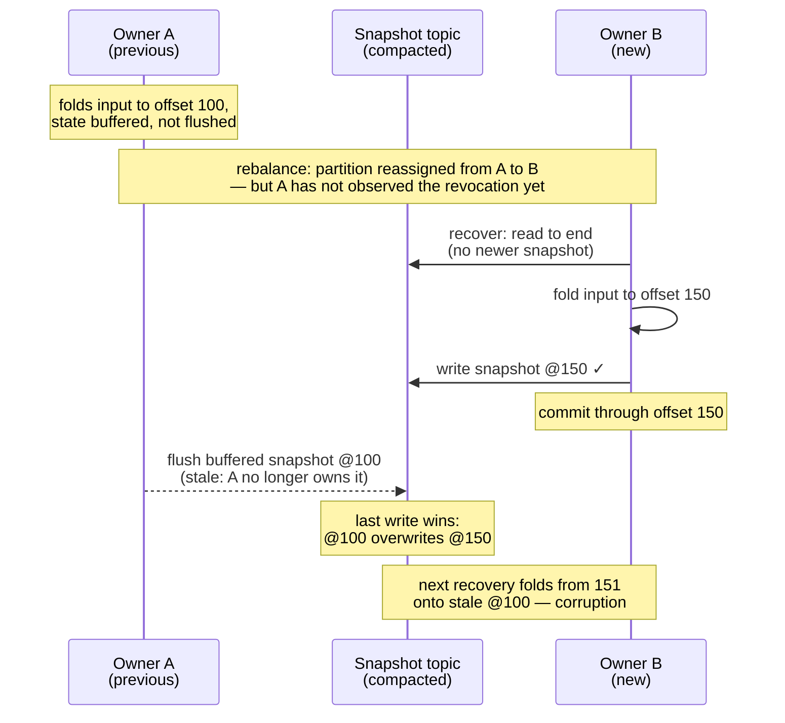
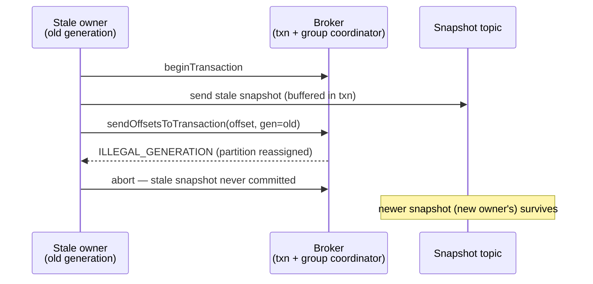

Design notes for the transactional snapshot mode of `kafka-flow-persistence-kafka`
(`KafkaPersistenceModuleOf.cachingTransactional`) — the mechanism and the measurements behind it.

## Problem

[kafka-flow#732](https://github.com/evolution-gaming/kafka-flow/issues/732): consumer-group
ownership of the input topic does not extend to the snapshot topic. During a rebalance a previous
owner that has not yet observed the revocation (a network issue, a GC pause, a slow poll loop —
typical during broker maintenance or high-load restarts) keeps writing snapshots alongside the new
owner — overlaps of tens of seconds have been observed in production. The snapshot topic is
compacted (last-write-wins), so a stale snapshot can overwrite a newer one; the next recovery then
loads stale state but resumes from the committed offset, so the events between the two snapshots
are never re-folded — corrupting the state.

## Mechanism

Two mechanisms carry the design: the generation fence stops a stale owner's write from landing, and
the high-watermark-bounded recovery read keeps recovery complete where no fence is violated. The
stable `transactional.id` keeps that read's ordinary wait sub-second, and the stall deadline bounds
a wait that never resolves; the remaining sections trace the fence across rebalance protocols and
detail the write path's group commit.

### Generation fencing

In the default (non-transactional) mode the input offsets are committed through the **Kafka consumer**
(the ordinary consumer-group offset commit). In this mode they are committed through the snapshot
**producer** instead, with the consumer-side commit disabled — the offset moves **into the producer's
transaction** via
`sendOffsetsToTransaction(offsets, consumerGroupMetadata)`
([KIP-447](https://cwiki.apache.org/confluence/display/KAFKA/KIP-447%3A+Producer+scalability+for+exactly+once+semantics),
brokers 2.5+):
the group coordinator validates the consumer **generation** and rejects a commit from a stale one
(`ILLEGAL_GENERATION`, surfaced to the client as `CommitFailedException`).
Since that commit and the snapshot writes share a transaction, the rejection aborts the writes too.
The generation gates both, so a stale owner can neither advance offsets nor overwrite a newer snapshot.

Seen as a whole, the mechanism combines two ideas — a distributed lock, and a transactional snapshot
write + offset commit. Kafka's consumer group is the lock, and it already provides both an ownership
*lease* and a [fencing token](https://martin.kleppmann.com/2016/02/08/how-to-do-distributed-locking.html):
the partition assignment is the lease, and the **generation** (bumped on each rebalance) is the token.
What is missing by default is only the link: the snapshot write is not bound to the fenced offset
commit. Binding them in one transaction is the link.

This is corruption prevention, not exactly-once. Output produces go through the application's own
producer, and the transaction wraps only the snapshot write and the offset commit, so they stay outside
it — enrolling them would be full transactional output, an explicit non-goal (see Rejected alternatives).
Output is therefore at-least-once: a replayed batch re-emits it, so the consuming side must tolerate
duplicates. The **committable offset** — the minimum offset still held across the partition's keys — is
never ahead of the persisted snapshots: an offset becomes committable only after its snapshot is
persisted, so recovery never skips events.

Key points:

- **Every** transaction commits the partition's current committable offset, so every write is gated. The
  offset itself advances only on the periodic offset-commit interval (`commitOffsetsInterval`, separate
  from the snapshot-flush interval `persistEvery`) or on revoke; a snapshot write never advances it —
  the write just re-commits the current value to stay gated. That advance is committed in a
  transaction — batching in any snapshot writes queued at that moment, or committing the offset
  alone (an *offset-only* transaction) when there are none.
- The offset-to-commit is **seeded with the assigned offset**, so even the first snapshot flush (before
  the first commit tick) carries an offset and is gated.
- Recovery is forced to `read_committed` so a fenced writer's aborted records are invisible, and its
  read targets the high watermark, so an open transaction on the snapshot topic delays the read
  instead of silently under-reading (see Recovery read below).
- The ordinary consumer-group offset commit is **replaced**, not run alongside. In the default mode the
  committable offset is staged and the **consumer** commits it; in this mode that same offset-scheduling
  step is rerouted to the **producer**, so the offset is committed only inside the transaction (above).
  The consumer-commit path still runs each poll cycle but now finds nothing staged — a no-op — so the
  partition is never committed through the consumer.
- Both the write and the offset-only commit are **synchronous** — there is no background committer, so
  the call itself drives the transaction and blocks on its outcome. That blocking is what lets a fence
  (`CommitFailedException`) propagate into the flow and crash a stale owner, rather than being lost on a
  fire-and-forget commit thread.
- The fence is per **member + generation**, not per partition: the coordinator checks the committer's
  generation, not which partitions it still owns, so a member still on the current generation cannot be
  stopped from committing a partition it just lost. That is closed client-side: a revoked partition's
  flows are torn down inside the synchronous revoke callback, and the broker does not reassign the
  partition until that callback returns — so no new owner exists while a flow for the partition is
  still alive. The one way out is eviction (teardown stalling past the rebalance timeout), which only
  swaps the net: an evicted member's commits fail member validation (`UNKNOWN_MEMBER_ID`, the same
  abortable `CommitFailedException`).

The mechanism needs the input topic-partition and a reader of the driving consumer's group metadata
(`Consumer.groupMetadata`, refreshed after every poll on the poll thread). Both are supplied by the flow
from the partition assignment — not configured by hand — so they always match the consumer that drives
the flow.

A generation captured once at assignment would miss a routine case: a rebalance can advance the
generation while leaving this member's partitions unchanged. The capture would go stale, and the
retained partition's next transactional commit would be spuriously fenced though the member still owns
it, crashing a still-valid owner — safe (a fenced commit writes nothing), but not stable. Refreshing
after every poll avoids it: a post-poll read follows the silent bump a rebalance callback does not.
The unknown (negative) pre-join generation is never published — for a commit carrying it against an
empty group (exactly the pre-join case) the coordinator *skips* generation validation, so it would
land unfenced; a flush before the first join instead fails loudly rather than committing ungated.

### Recovery read: bounded by the high watermark

An open transaction on the snapshot topic distorts what a `read_committed` reader may see: the
consumer's own `endOffsets` is the **last-stable-offset** (LSO) — the minimum of the high watermark and
the first offset of any open transaction — so a read bounded by it completes while silently missing
committed snapshots above the pin. With a second handover inside the window the next owner recovers
stale state yet resumes from the newer committed input offset — the corruption shape of
[#732](https://github.com/evolution-gaming/kafka-flow/issues/732) with no fence violated.

So the read target is the **high watermark**, captured up front by a short-lived `read_uncommitted`
consumer, whose `endOffsets` returns it rather than the last-stable-offset. The `read_committed`
position cannot pass the LSO until the broker resolves the open transaction, so the read genuinely
waits it out. Kafka Streams' exactly-once changelog restore settled on the same shape after its
LSO-derived end offset was found to under-read ([KAFKA-10167](https://issues.apache.org/jira/browse/KAFKA-10167)).

On the ordinary path the bound is free: the partition's own unfinished transactions are aborted at
takeover by the shared `transactional.id`, before recovery reads (next section), so the captured
target equals the LSO and the read never waits. It waits only for a transaction no takeover aborts —
a previous `transactional.id` prefix's unfinished transactions while a prefix change rolls out, or
a producer misdirected at the snapshot topic — and there, waiting is the only correct behavior,
bounded by the *pinning* producer's `transaction.timeout.ms` plus the broker's abort scan
(`transaction.abort.timed.out.transaction.cleanup.interval.ms`, default 10 s): ~70 s at Kafka's
default timeout.

### Stable transactional.id: the takeover aborts unfinished transactions

Each partition's producer uses a **stable** `transactional.id`, `"<prefix>-<partition>"` — a scheme
whose cost, a producer per partition, this mode pays anyway. Every owner of a partition shares its
id, so a new owner's mandatory `initTransactions` fences the previous owner's producer and aborts
any transaction it left open, before the new owner may write.

Sharing the id serializes the partition's own writes: a committed snapshot never sits above an open
transaction of the same id, so the recovery read's wait (previous section) never engages for the
module's own transactions. Takeover after a hard crash is immediate — nothing waits for
`transaction.timeout.ms`.

The shared id is deliberately **not** the fence. Fencing of stale writers stays with the consumer
generation bound into every commit, never with producer-epoch order, for two reasons. The epoch fence
does not exist until the new owner's init: a stale flush racing ahead of it meets no epoch check at
all, while the generation was already bumped when the rebalance completed — the takeover window is
covered by the generation fence alone. And the epoch order can diverge from ownership order
(whichever owner inits *latest* wins), so a late-initing stale owner can win the epoch and fence the
partition's valid owner — one crash of a valid owner (availability, not safety); the stale
owner's write still dies at the generation fence. What the stable id buys is only the takeover-abort above.

The cost is a naming discipline: the prefix becomes cluster-scoped, like a group id — one prefix per
flow, unique on the cluster, or colliding applications fence each other's producers, loudly; on an
ACL-secured cluster the prefix is what the producer principal must be authorized for.
`transaction.timeout.ms` remains only the backstop for unfinished transactions no takeover reaches —
e.g. a stalled but live producer's — and skafka's default (1 min) is kept, since a group-committed
batch typically commits in well under a second.

The completeness of recovery does not depend on any naming assumption: the id discipline buys the sub-second
common case; the read bound (previous section) holds regardless.

### Stalled read: a deadline instead of a silent hang

The recovery read waits by design: it keeps polling until its `read_committed` position reaches the
captured high-watermark target (Recovery read, above). Two known Kafka failure modes can keep that
position from ever reaching it. The first is **truncation**: the log end regresses below the captured
target — a leader election lost acknowledged snapshot records — so the target is permanently
unreachable. That regression takes an opted-in unclean election or a genuine disaster: rare, but no
broker version or configuration removes the risk entirely — replication only sizes the disaster.
With `min.insync.replicas` ≥ 2, an acknowledged snapshot (the transactional producer forces
`acks=all`) sits on at least two replicas and survives any single broker failure; at the broker
default of 1, the in-sync set may shrink to the leader alone and one lost disk suffices.
Recomputing the target would unblock the read at the price of re-admitting the silent under-read
the capture exists to prevent, so the target deliberately stays put.

The second is a **hanging transaction**: an LSO pin that no timeout ever clears
([KIP-664](https://cwiki.apache.org/confluence/display/KAFKA/KIP-664%3A+Provide+tooling+to+detect+and+abort+hanging+transactions)
added the `kafka-transactions.sh` tool to detect and abort it);
[KIP-890](https://cwiki.apache.org/confluence/display/KAFKA/KIP-890%3A+Transactions+Server-Side+Defense)
broker-side verification, on by default since Kafka 3.6, prevents the class, confining this cause to
older or opted-out brokers.

Both are rare, and silent when they hit: the unbounded read hangs the poll thread inside the
rebalance callback, nothing crashes, and `max.poll.interval.ms` evicts the member while
process-level health checks stay green.

When the read's position stops advancing, a no-progress deadline (`recoveryStallTimeout`, default 3
min, reset by every position advance) fails the read loudly. The wait it must outlast is
bounded — an open transaction resolves within ~70 s at defaults, which the takeover-abort collapses
to sub-second for the partition's own — so the deadline sits above that wait and below
`max.poll.interval.ms`: high enough not to fire during a legitimate wait, low enough to fire before
the member is evicted. It is the fallback for a wait that never resolves. Failing also heals: the
reading consumer is group-less, so eviction never unwinds the stuck thread but the error frees it,
and the restarted recovery captures a fresh target. After a truncation that restart completes, but
over the shortened log, so the loss stands until an operator acts (below); behind a hanging
transaction it fails loudly again until the pin is cleared.

The failure is diagnosed by re-reading the log end, because the two causes need opposite responses:
below the captured target names truncation — the records are gone, so recovery becomes an
offset-reset or restore decision for an operator; at or above it names an open transaction that
outlived the deadline — a hanging one, or one whose timeout simply exceeds the deadline and will
heal on its own. The deadline flags a truncation only while a read is in flight, and reads run
only at recovery — so a truncation usually lands between reads and is adopted silently: the next
read captures its fresh target from the already-shortened log and completes, folding onward input
onto the older surviving state — the Problem's corruption shape, from broker-side loss instead of a
stale writer. The guard against losing records is the replication above, not the deadline.

Only the transactional mode enables the deadline, because only it forces the `read_committed`
read that carries the designed wait. A non-transactional module configured with `read_committed`
inherits the same bounded target and its wait, without the deadline.

### Consumer rebalance protocols

The per-member fencing token is the **generation** under the classic protocol and the **member epoch**
under the consumer protocol
([KIP-848](https://cwiki.apache.org/confluence/display/KAFKA/KIP-848%3A+The+Next+Generation+of+the+Consumer+Rebalance+Protocol),
GA in Kafka 4.0, selected by `group.protocol=consumer`); they play the same role, and *generation* below
stands for both. The fence holds under both protocols and surfaces identically — a stale transactional
commit is rejected as `ILLEGAL_GENERATION` under each (the coordinator maps the consumer protocol's
internal stale-epoch error to the same wire error). The post-poll read (above) is what makes the
tracking hold too: the bump that matters — one that changes nothing in this member's assignment — fires
no callback at all under the consumer protocol (the epoch advances on the background heartbeat thread)
and, under the classic **cooperative** assignor, only an empty-delta `onPartitionsAssigned` that the
typed listener drops ([skafka#581](https://github.com/evolution-gaming/skafka/issues/581)); only the
classic **eager** assignor — which revokes and reassigns the full set on every rebalance — fires a
callback that could be acted on.

What the read cannot close is a residual window in which a still-valid owner is spuriously fenced — a
liveness cost, never a safety one (a lagging token only fences). Under the classic protocol the window
is the in-flight join round: a round can span polls
([KIP-266](https://cwiki.apache.org/confluence/display/KAFKA/KIP-266%3A+Fix+consumer+indefinite+blocking+behavior)),
and a flush of a retained partition
between the broker-side bump and this member completing the round still carries the previous
generation. Under the consumer protocol the epoch also advances *between* polls, so even a fresh
post-poll read can be stale by the time the commit reaches the broker.
[KIP-1251](https://cwiki.apache.org/confluence/display/KAFKA/KIP-1251%3A+Assignment+epochs+for+consumer+groups)
(brokers 4.3.0+) absorbs the consumer-protocol window — the coordinator accepts a lagging commit for a
partition the member still owns, and a reassigned one stays fenced — hence `group.protocol=consumer`
is recommended only with such brokers (below 4.3.0 its window is the wider one); no broker version
absorbs the classic in-flight-round window.

The revoke-time flush is the one place the combinations differ in outcome. Classic **eager** revokes
before the member rejoins, and the consumer protocol keeps the member on its epoch until it
acknowledges the revocation — under both, the flush commits. Classic **cooperative** has already moved
the member to the new generation by revoke time, so its flush is always fenced (safe; the new owner
replays). A member evicted before the flush is rejected under all three — the same safe direction.

### Write path: group-committed transactions

A producer allows one transaction at a time, while kafka-flow flushes a partition's keys in
parallel — and after a fresh assignment most of the active key population flushes in one wave per
`persistEvery`. Writes are therefore **group committed**: a write is queued, and the first writer to
take the per-partition transaction lock drains the queued writes at that moment — up to the cap below —
into a single transaction (offset commits ride along without consuming the cap) and delivers the outcome
to each waiter. No batching delay — a lone write commits immediately; a batch is whatever accumulated
during the previous transaction's flight.

`maxWritesPerTransaction` (default 256) caps the batch. Transactions are serial — the next cannot
begin until the current commits — so a partition's sustained write rate ≈ cap / transaction time.
Raising the cap past the default gains little (uncapped measured ~7% faster, below): transaction time
grows with the batch. The cap's job is to bound transaction duration (commit within
`transaction.timeout.ms`, default 1 min) and bytes (≈ cap × snapshot size).

A snapshot write does not complete until its transaction commits, and the flush awaits each write, so
the source is back-pressured: outstanding writes are bounded by the flush concurrency (one per live key
in the wave), not by internal buffering.

## Implementation

Entry point: `KafkaPersistenceModuleOf.cachingTransactional`. In the current code:

- **Group-committed transactional writes** — `KafkaSnapshotWriteDatabase.transactional` (the
  `GroupCommit` machinery); the per-partition transactional producer is built in `KafkaPersistenceModule`.
- **Offset commit** (on the periodic tick / on revoke; an offset-only transaction when no snapshot
  writes are pending) — `ScheduleCommit`.
- **Consumer-commit reroute** — at wiring the module's `scheduleCommit` (the transactional `ScheduleCommit`)
  overrides the default consumer-backed one (`kafkaPersistenceModule.scheduleCommit.getOrElse(...)` in the
  persistence-kafka `package` object). That bypasses the default path, where offsets are normally staged
  through `PendingCommits` and committed by `TopicFlow.commitPending` via `consumer.commit`; with nothing
  staged, it commits nothing (a no-op).
- **Generation currency** — the `Consumer` wrapper holds `groupMetadata` in a `Ref`, refreshed after every
  poll.
- **Recovery read** — `KafkaPartitionPersistence.readSnapshots` (the high-watermark capture, the
  drain to target, the start-of-read wait warn — logged when the captured target sits above the LSO).
- **Stall deadline** — the read loop `KafkaPartitionPersistence.readPartitionWithDeadline`, failing
  with `RecoveryReadStalledError` at `recoveryStallTimeout`.

## Measurements

From `TransactionalWriteThroughputSpec`: single-node testcontainers broker on localhost, replication
factor 1, no network latency — a *floor*; expect a few ms per transaction against real brokers. Each
number is the min of 3 runs on a fresh state topic. Read them as orders of magnitude.

**Experiment A** — 500 keys, small snapshots, one partition, cap held at the default (256); the only
thing that varies is whether the writes are issued one at a time (sequentially) or all at once
(concurrently):

| Mode | Issued | Result |
|---|---|---|
| Shared batched producer (default, no transactions) | one at a time | 197 ms |
| Group-committed transactions | one at a time | 879 ms (500 txns, ~1.8 ms/txn) |
| Group-committed transactions | all at once | 13 ms (a few batches) |

This isolates one variable: group commit only pays off when writes are issued together. Issued one at a
time, nothing batches, so transactions run one per write — several times slower than the plain producer;
issued all at once, the writes collapse into a few transactions and that cost is gone. The plain
producer is measured one-at-a-time only as a reference point — not a fair head-to-head, since
nothing makes it batch here. The fair comparison, both issued concurrently against realistic
payloads, is Experiment B.

**Experiment B** — 2000 keys, 10 KiB snapshots, flushed **concurrently** (the *post-assignment wave*: a
new owner recovers all its keys, so they fall due together, and the timer tick fans the per-key flushes
out concurrently — `parTraverse` across keys in `PartitionFlow`, which the test mirrors). The cap bounds
writes per transaction, so the transaction count is ≈ `N / cap`:

| Configuration | ≈ transactions | Result |
|---|---|---|
| Shared batched producer (baseline) | — | 282 ms |
| `maxWritesPerTransaction = 1` | 2000 | 4 002 ms |
| `maxWritesPerTransaction = 16` | 125 | 513 ms |
| `maxWritesPerTransaction = 256` (default) | ≈ 8 | 300 ms |
| `maxWritesPerTransaction = 2000` (uncapped) | 1 | 279 ms |

Cost tracks the transaction count until Kafka's network batching floors it (~280–300 ms). At the
default cap the burst is within ~6% of the plain baseline; at cap = 1 (a transaction per write) it is
an order of magnitude slower — multi-second poll-path stalls at realistic key counts.

Reproduce: `KAFKA_FLOW_PERF=1 sbt "persistence-kafka-it-tests/testOnly *TransactionalWriteThroughputSpec"`
(the suite is excluded from the default run).

## Testing

Integration tests (`TransactionalKafkaPersistenceSpec`, in persistence-kafka-it-tests) run against a
real broker:

- **Reproduction and prevention** — the corruption pair runs the real recovery and flush-on-revoke
  machinery (`kafkaEagerRecovery` — every key recovered on assignment): corruption reproduced with
  the plain shared producer (no offset binding); prevention drives a stale owner with an *older
  consumer generation* and asserts the newer snapshot survives.
- **Generation fence, isolated** — under the stable id a stale flush dies at the epoch fence first
  (Stable transactional.id, above), so these tests drive a live, unfenced producer whose generation
  alone is stale: the next periodic flush fails fast, the first flush is gated by the offset seeded
  at assignment, and a transactional offset commit is rejected.
- **Concurrent writes** — a partition's keys flush in parallel against the one shared producer
  (Write path, above); asserted safe for distinct keys.
- **Unfinished transactions, both resolutions** — the takeover-abort at the handover: the
  last-stable-offset is back at the high watermark immediately after module acquisition, a state
  only the abort produces, never the broker's timeout; the same test pins the
  `"<prefix>-<partition>"` id shape. And the wait for a transaction no takeover aborts (Recovery
  read, above): a foreign transaction held open through the read, its LSO pin asserted active, then
  waited out under a deadline set above the wait — the read completes, the deadline never fires.

The suites drive flows with explicit consumer generations rather than live rebalances; the
protocol/assignor matrix (Consumer rebalance protocols, above) rests on broker semantics, not on
tests here.

Unit suites pin the client-side pieces the mechanism depends on:

- **`ConsumerSpec`** (core) — the post-poll generation tracking and the negative-generation guard.
- **`TopicFlowSpec`** (core) — `TopicFlow.remove` returns only after the partition's flows tear
  down — the client-side close of the fence's per-partition gap (Generation fencing, above) — and
  a partition flow's group metadata is a live reader, never a cached copy.
- **`GroupCommitSpec`** (persistence-kafka) — the group commit against a recording producer,
  broker-free (the fence itself is the integration suite's job): the committed offset never leads
  the writes it covers; offset-only commits ride free of the cap; a missing generation fails loudly
  instead of committing ungated; and the generation is read live per transaction, never cached.
- **`KafkaPersistenceModuleSpec`** (persistence-kafka) — the module's wiring: the producer settings,
  the `read_committed`-from-earliest read with the deadline enabled.
- **`ReadSnapshotsSpec`** (persistence-kafka) — the read itself: the high-watermark target (a read
  bounded at the reader's own `endOffsets`, the LSO, would silently under-read), the deadline with
  its diagnosis (a failing re-read never masks the stall), a progressing read outliving the
  deadline, and the control (with no deadline the read stays unbounded).

## Rejected alternatives

- **Transactional snapshot read + snapshot write**: fence a stale writer with a compare-and-set on the
  stored offset instead of the group generation. Kafka has no conditional produce primitive, so it
  cannot be atomic.
- **Offset tracking in snapshot**: store each key's offset inside its snapshot and, on recovery,
  resume the partition from the minimum offset across its keys. Damage limitation, not prevention —
  the stale write still lands (the topic stays last-write-wins), and healing replays the whole
  partition from the oldest surviving key. The generation fence prevents the write from landing at
  all.
- **Producer-epoch order as the fence**: epoch order can diverge from ownership order, spuriously
  fencing the true owner — the stable id is kept for the takeover-abort, never as the fence (see
  Stable transactional.id).
- **Unique per-assignment `transactional.id`s** (`"<prefix>-<partition>-<uuid8>"`): with no shared
  id a late-initing stale owner cannot win the epoch and spuriously fence the valid owner (see
  Stable transactional.id) — but nothing ever aborts a crashed owner's unfinished transaction, so
  every post-crash recovery waits out the full transaction timeout the stable id resolves at init,
  and coordinator state accumulates per assignment until `transactional.id.expiration.ms`. Either
  choice is sound (the read bound holds under both); the sub-second takeover was judged worth the
  spurious-fence cost.
- **Static partition assignment** (`assign()` instead of `subscribe()`): no consumer group, so no
  rebalance, no overlap window, no fence needed — but it gives up automatic failover and elastic
  reassignment, and safe *dynamic* assignment is the point of this design. (Static *membership*
  ([KIP-345](https://cwiki.apache.org/confluence/display/KAFKA/KIP-345%3A+Introduce+static+membership+protocol+to+reduce+consumer+rebalances))
  is not a substitute: it suppresses rebalances only for graceful restarts within `session.timeout.ms`,
  and does not fence a stuck owner whose session expired.)
- **Transaction per write**: correct but O(keys) round-trips on the poll path (cap = 1 above).
- **Unbounded batches**: ~7% faster, but transaction duration scales unbounded against the coordinator
  timeout.
- **Transactional output produces (full exactly-once)**: out of scope; output stays at-least-once.
- **Capturing the generation in a rebalance callback** (instead of the post-poll read): the bump that
  matters fires no callback under two of the three protocol/assignor combinations (see Consumer
  rebalance protocols).

## Forward-looking

[KIP-939 (participation in 2PC)](https://cwiki.apache.org/confluence/display/KAFKA/KIP-939:+Support+Participation+in+2PC)
is the route to extend this fence to non-Kafka snapshot stores: a transactional producer in an
externally-coordinated two-phase commit could bind a snapshot write in another store (e.g. Cassandra or
an RDBMS) to the same generation-fenced Kafka offset commit, giving that store the per-partition
ownership guarantee this mode has. Not actionable now.
