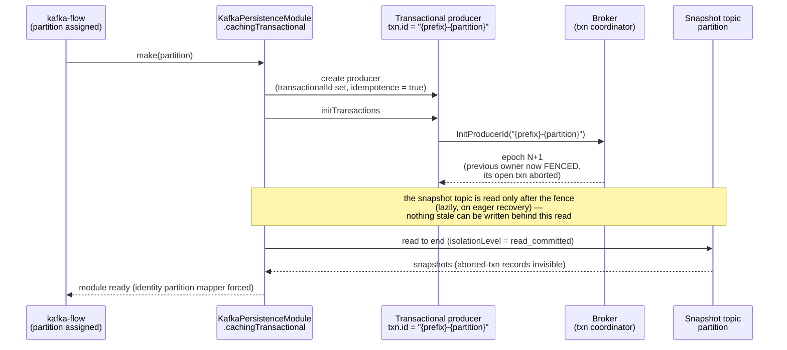
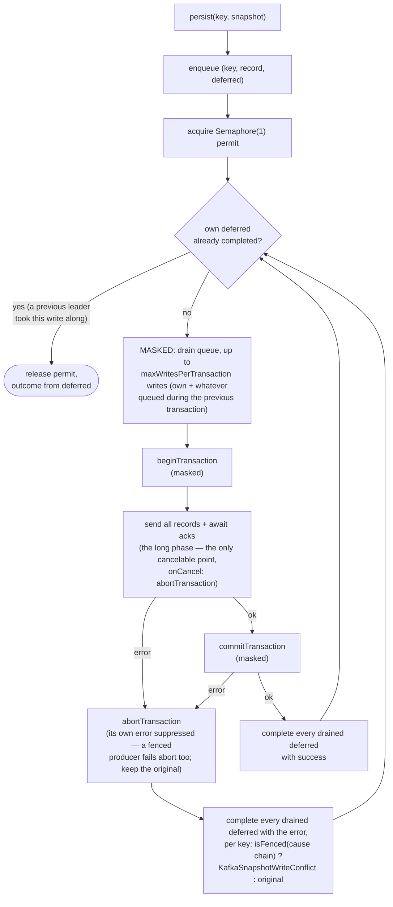

Design document for the transactional snapshot mode of `kafka-flow-persistence-kafka`
(`KafkaPersistenceModuleOf.cachingTransactional`). User-facing guarantees, limitations and rollout
guidance live in [Persistence](persistence.md); this page records the problem, the decisions, why
they were made, and the measurements behind them.

## Problem

[kafka-flow#732](https://github.com/evolution-gaming/kafka-flow/issues/732): consumer-group
ownership of the input topic does not extend to the snapshot topic. During a rebalance, a previous
partition owner that has not yet observed the revocation (network issue, GC pause, slow poll loop —
overlaps of tens of seconds observed in production) keeps writing snapshots in parallel with the
new owner. A compacted topic is last-write-wins, so the stale snapshot overwrites the newer one and
the next recovery silently starts from stale state: events between the two snapshots are lost even
though the input offsets were committed correctly.

## Goals and non-goals

Goals:

- A stale writer must not be able to overwrite a newer snapshot — at any point after the new owner
  starts reading the snapshot topic.
- Opt-in: the default (shared producer, no transactions) behavior stays byte-for-byte unchanged.
- The cost must be acceptable for bursty flush patterns: keys recovered together share their flush
  baseline, so they become persist-eligible in synchronized waves every `persistEvery`, and each
  wave writes every key whose state changed since the last flush — in a busy partition, approaching
  the full active population.

Non-goals:

- Exactly-once processing. Input offsets are still committed by the consumer, outside the snapshot
  transaction (`sendOffsetsToTransaction` would require rerouting core offset committing through
  the producer). Fencing alone removes the corruption; a fenced instance's events are replayed, not
  lost.
- Non-identity partition mappers. Fencing is per input partition; a state partition shared by
  writers with different `transactional.id`s would make read-to-end recovery under `read_committed`
  ill-defined. The mode forces the identity mapping.

## Design

### Fencing: one transactional producer per assigned partition

The protection is Kafka's own zombie fencing. Each assigned input partition gets its own producer
with a stable `transactional.id` of `"{prefix}-{partition}"`; `initTransactions` bumps the producer
epoch on the broker, fencing the previous owner of the same partition. The fence lands **before**
the snapshot topic is read — that ordering is the core of the design: after it, nothing stale can
be written behind the recovery read.

| Decision | Rationale |
|---|---|
| Stable `transactional.id` per input partition | Fencing is per `transactional.id`: old and new owner of the *same* partition must collide on the same id; different partitions must not. The prefix must be stable across deployments and unique per consumer group + input topic + snapshot topic — these contracts cannot be enforced in code and are documented. |
| `initTransactions` before the recovery read | Read-then-fence would leave a window in which the old owner writes behind the completed read. |
| Recovery forced to `read_committed` | A fenced owner's in-flight transaction is aborted, but its records sit in the log until compaction; `read_uncommitted` would resurrect them as valid snapshots. (`initTransactions` also waits out any open transaction of the previous incarnation, so the read-to-end target is exact.) |

### Write path: group-committed transactions

The Kafka producer allows one transaction at a time, while kafka-flow flushes a partition's keys in
parallel, and keys recovered together flush in synchronized waves — after a restart, every key that
changed since the last flush (in a busy partition: most of the active population) arrives as one
burst every `persistEvery`. One transaction per write
would serialize that burst on the consumer poll path (~4 s for 2000 keys, measured below). Writes
are therefore **group committed**: a write is queued, and the first writer to take the transaction
lock drains everything queued at that moment into a single transaction, delivering the outcome to
each waiter. There is no batching delay — a lone write commits immediately; a batch is whatever
accumulated during the previous transaction's flight.

| Decision | Rationale |
|---|---|
| Group commit, not time-window batching | Batching is purely opportunistic: sporadic writes pay zero added latency, bursts collapse to O(burst / cap) transactions. A batch shares its transaction's outcome — one failure fails them all (bounded by the cap). |
| Drain and completion run masked, only the ack await is cancelable | A canceled leader must never remove writes from the queue without delivering their outcome (waiters would hang or get a nonsense error), and must never leave an open transaction holding the lock's next user hostage (`onCancel: abort`). |
| `maxWritesPerTransaction` cap (default 256, configurable) | Not for throughput — Kafka batches the network traffic itself and uncapped is ~9% faster (measured below). The cap bounds *transaction duration*: a transaction outliving `transaction.timeout.ms` (default 1 minute) is aborted by the coordinator (demonstrated below). Transaction bytes ≈ cap × snapshot size, and this layer cannot see record sizes (serialization happens inside the producer), so the bound is a configurable count — lower it for large snapshots. |
| Fencing classified by walking the exception cause chain | A fenced producer moves to a fatal state; follow-up calls throw a generic `KafkaException` only *wrapping* the fencing exception. |
| Leader-based lock instead of a background committer fiber | A worker fiber would simplify the write path but adds a Resource lifecycle and a liveness dependency (a dead worker hangs all writes); the leader protocol keeps failure handling local to the writes. |

### How a rejection surfaces

Verified by flow-level tests reproducing issue #732 end-to-end (`TransactionalKafkaPersistenceSpec`):

- During a **periodic flush**, the conflict fails the flow of the stale instance — safe, it no
  longer owns the partition (swallowed if `persistPeriodically(ignorePersistErrors = true)`).
- During **flush-on-revoke**, the conflict is logged and swallowed by the key release — appropriate
  for a partition that is being given away.
- In both cases nothing is written and no offsets are committed for the rejected write; the new
  owner replays the events.

One caveat found by deliberately breaking the timeout (see below): a transaction aborted by the
coordinator for outliving `transaction.timeout.ms` surfaces as `InvalidTxnStateException` on some
broker/client version-and-timing combinations — not classified as a conflict — but as
`InvalidProducerEpochException` on others, which **is** indistinguishable from real fencing. The
cap keeps transactions orders of magnitude below the timeout precisely so this ambiguity stays
theoretical.

## Measurements

From `TransactionalWriteThroughputSpec`: single-node testcontainers broker on localhost,
replication factor 1, no network latency — a *floor*; expect a few milliseconds per transaction
against real brokers. Each producer does an untimed warm-up write before measurement.

| Scenario | Result |
|---|---|
| 500 small snapshots, shared batched producer (default mode), sequential | 219 ms |
| 500 small snapshots, one transaction per write, sequential | 698 ms (~1.4 ms per transaction) |
| 500 small snapshots, concurrent burst, group committed | 11 ms |
| 2000 × 10 KiB burst, `maxWritesPerTransaction = 1` | 4 070 ms |
| 2000 × 10 KiB burst, `maxWritesPerTransaction = 16` | 666 ms |
| 2000 × 10 KiB burst, `maxWritesPerTransaction = 256` (default) | 382 ms |
| 2000 × 10 KiB burst, `maxWritesPerTransaction = 2000` (uncapped) | 348 ms |

Reading of the numbers: the default cap costs ~9% over uncapped while keeping each transaction
(256 × 10 KiB ≈ 2.5 MiB) at ~50 ms — three orders of magnitude below the 1-minute transaction
timeout here, roughly two orders of magnitude below it at production latencies. Without the group
commit (cap = 1), a post-restart burst pays per-transaction latency × keys: multi-second poll-path
stalls at realistic key counts.

The timeout failure mode, demonstrated with `transaction.timeout.ms = 1s` and a transaction held
open until the coordinator's abort checker fires: across runs the commit failed with
`InvalidTxnStateException` ("The producer attempted a transactional operation in an invalid
state") or `InvalidProducerEpochException` ("attempted to produce with an old epoch") — the
variance behind the caveat above.

## Testing strategy

- **Issue reproduction first**: `TransactionalKafkaPersistenceSpec` replays the #732 mechanism
  through the real machinery (PartitionFlow, eager recovery, fold, buffered snapshots,
  flush-on-revoke) with two flows over one partition — the rebalance notification itself is
  Kafka's guarantee and is simulated by construction. The *reproduction* test asserts the
  corruption happens with the shared producer; the *prevention* test runs the identical scenario
  transactionally and asserts the newer snapshot survives. Each test is the other's counterfactual.
- **Failure-mode pins**: fenced writer fails fast on its next periodic flush; an open transaction
  of a fenced writer neither blocks nor leaks into recovery; concurrent writes are safe on the
  shared producer (both at the default cap and at cap = 1); the timeout abort demonstration.
- **Performance**: `TransactionalWriteThroughputSpec` (numbers above) runs in the suite, so the
  numbers stay current.

## Rejected alternatives

- **Cassandra-style compare-and-set**: not expressible on a Kafka topic — there is no conditional
  produce.
- **Transaction per write, serialized**: correct but burst cost is O(keys) transaction round-trips
  on the poll path (the cap = 1 row above).
- **Unbounded batches**: ~9% faster than the default cap, but transaction duration then scales with
  burst × snapshot size, unprotected against the coordinator timeout abort.
- **Background committer fiber**: see the design table — liveness dependency on a supervised
  worker.
- **Full exactly-once via `sendOffsetsToTransaction`**: see non-goals.
